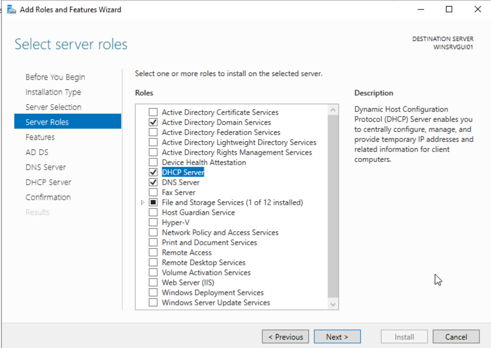
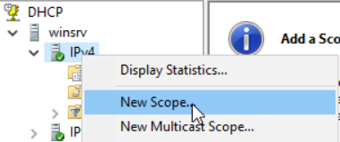
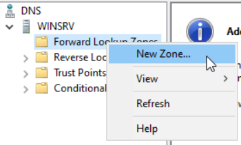
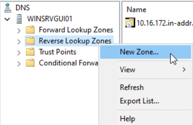

# 🖥️ Guide installation sprint 2-3

## Sommaire

### 1. [Paramétrage des IP](#Paramétrage-des-IP)
### 2. [Installation des rôles sur Windows Server 2022 GUI](#roles_windows_gui)
#### 2.1 [Installation des rôles sur Windows Server 2022 GUI](#install_roles_windows_gui)
#### 2.2 [Configuration du rôle AD DS sur Windows Server 2022 GUI](#config_adds_windows_gui)
#### 2.3 [Configuration du rôle DHCP sur Windows Server 2022 GUI](#config_dhcp_windows_gui)
#### 2.4 [Configuration du rôle DHS sur Windows Server 2022 GUI](#config_dns_windows_gui)
### 3. [Installation des rôles sur Windows Server 2022 GUI](#roles_windows_gui)
### 4. [Configuration Serveur Debian](#config-debian)

### 1. Paramétrage des IP  
<span id="Paramétrage-des-IP"></span>
Nous allons configurer les machines pour atteindre cette configuration finale : 

| Nom   | OS       | IP | DNS primaire |
| :-: | :-: | :-: | :-: |
| 552 (G1-WINSRVGUI01) | Windows Server 2022 GUI | 172.16.10.1/24| 127.0.0.1 |
| 553 (G1-LINSRV01) | Debian 12. | 172.16.10.3/24| 172.16.10.1 |
| 554 (G1-WINSRVCORE01) | Windows Server 2022 Core | 172.16.10.2/24| 172.16.10.1 |
| 565 (G1-WINCLI01) | Windows 10 | 172.16.20.10/24| 172.16.10.1 |
| 564 (G1-WINCLI02) | Windows 10 | 172.16.20.10/24| 172.16.10.1 |

### 2. Installation et configuration des rôles sur Windows Server 2022 GUI
<span id="roles_windows_gui"></span>

#### 2.1 Installation des rôles sur Windows Server 2022 GUI
<span id="install_roles_windows_gui"></span>

Pour ajouter des roles sur un serveur Windows, il suffit d'aller sur le Server Manager, puis d'aller dans l'onglet **Manage** en haut, et de choisir **Add Roles and Features**.  
Pour le type d'installation, on choisit bien **Role-based or feature-based installation**, **Next**  
Nous sélectionnons le serveur GUI, **Next**  
Nous séléctionnons les rôles voulus : ADDS, DHCP, DNS, **Next** 



Puis on confirme et procède à l'installation.

#### 2.2 Configuration du rôle AD DS sur Windows Server 2022 GUI
<span id="config_adds_windows_gui"></span>
En haut, nous cliquons sur le drapeau puis sur **Promote this server to a domain controller**

#### 2.3 Configuration du rôle DHCP sur Windows Server 2022 GUI
<span id="config_dhcp_windows_gui"></span>

Nous cliquons également pour configurer le DHCP. Ici, rien de spécial à faire, on clique sur **Suivant** et **Commit**.   
Dans la console DHCP, on va bien sur le server, puis on fait un click droit sur IPv4 et **New Scope**


  
Nous entrons un nom d'étendue, **Next**, puis les limites en adresses IP de cette étendue. Il est préférable de laisser des adresses IP pour les dédier aux serveurs en statique. On n'oublie pas de vérifier le masque. **Next**  
Dans notre cas, nous ne configurons, au moins pour le moment, des exclusions. **Next**
Pour la durée du bail, nous pouvons laisser les 8 joours préconfigurés. **Next**, **Next**  
Nous avons entré ensuite une adresse de passerelle, par exemple : 172.16.10.254, puis nous avons cliqué sur **Add**, et **Next**
Nous entrons ensuite le nom du domaine, **Next**, **Next**, **Finish**


#### 2.4 Configuration du rôle DHS sur Windows Server 2022 GUI
<span id="config_dns_windows_gui"></span>

Pour le paramétrage du DNS, dans la console dédiée, nous faisons un click droit sur **Forward Lookup ZOnes**, puis **New Zone**.  


  
**Next**, Nous choisissons bien une zone primaire, **Next**  
On sélectionne **To all DNS servers running on domain controllers in this domain**  
Nous choisissons un nom pour la zone, **Next**  
On coche bien **Allow only secure dynamic updates**, **Next**  
**Finish**  

  
**Next**, Nous choisissons bien une zone primaire, **Next**  
On sélectionne **To all DNS servers running on domain controllers in this domain**  
Nous choisissons de faire une zone IPv4  , **Next**
On entre les 3 octets de l'adresse de réseau, ici : 172.16.10
On coche bien **Allow only secure dynamic updates**, **Next**  
**Finish**  


### 3. Configuration Windows Serveur Core
<span id="Configuration Windows Server Core"></span>

Pour la machine Windows Server Core, nous avons fait un clone de la machine template Windows Server Core sur Proxmox.

#### Réseau

- Configuration IP du serveur Windows Core  

`New-NetIPAddress -InterfaceAlias "Ethernet" -IPAddress "172.16.10.2" -PrefixLength 24 -DefaultGateway "172.16.10.254"`

- Paramétrage du DNS via le choix n°8 dans le menu du serveur.

Nous avons ajouté l'IP du contrôleur de domaine en DNS principla soit : 

`172.16.10.1`

En DNS secondaire nous avons indiqué la boucle locale du Windows Server Core

`127.0.0.1`

#### Intégration au domaine billu.lan 

L'ajout a été fait via le controleur de domaine installé sur l'autre serveur windows


### 4. Configuration Serveur Debian
<span id="config-debian"></span>

Pour la machine serveur Debian, nous avons fait un clone de la machine template Debian sur Proxmox.

#### Réseau

La configuration de l'ip a été faite en ajoutant le texte suivant au fichier ``/etc/network/interfaces`` :

```bash
auto ens18
iface ens18 inet static
    address 172.16.10.3/24
    gateway 172.16.10.254
```

La configuration du DNS pour cette machine a été effectuée en ajoutant le texte suivant au fichier ``/etc/resolv.conf`` :

```bash
nameserver 172.16.10.1
nameserver 8.8.8.8
nameserver 8.8.4.4
```

#### Intégration à l'AD

Afin d'intégrer cette machine à l'AD, nous avons installé les packets ``realmd``, ``sssd`` et ``packagekit``.

L'installation s'est faite avec cette commande :

```bash
apt-get install realmd sssd packagekit
```

Puis, pour rejoindre l'AD, nous avons utilisé la commande ``realm`` suivante :

```bash
realm join billu.lan
```

Pour limiter les accès en ssh au groupe DSI, nous avons modifié le fichier ``/etc/ssh/sshd_config`` en y ajoutant la ligne suivante :

```bash
AllowGroups dsi@billu.lan
```
