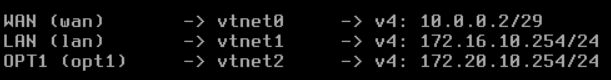
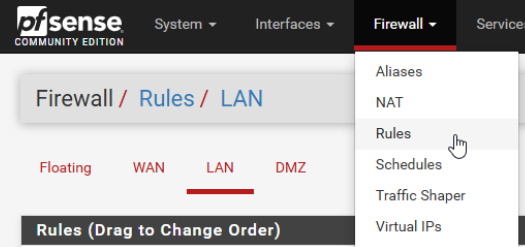
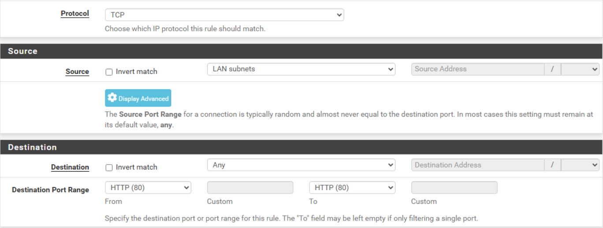
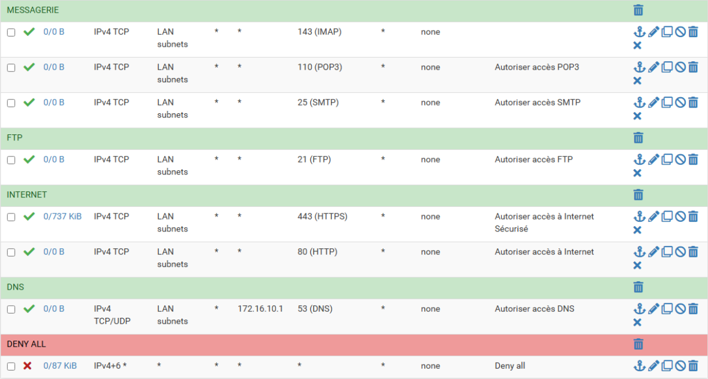
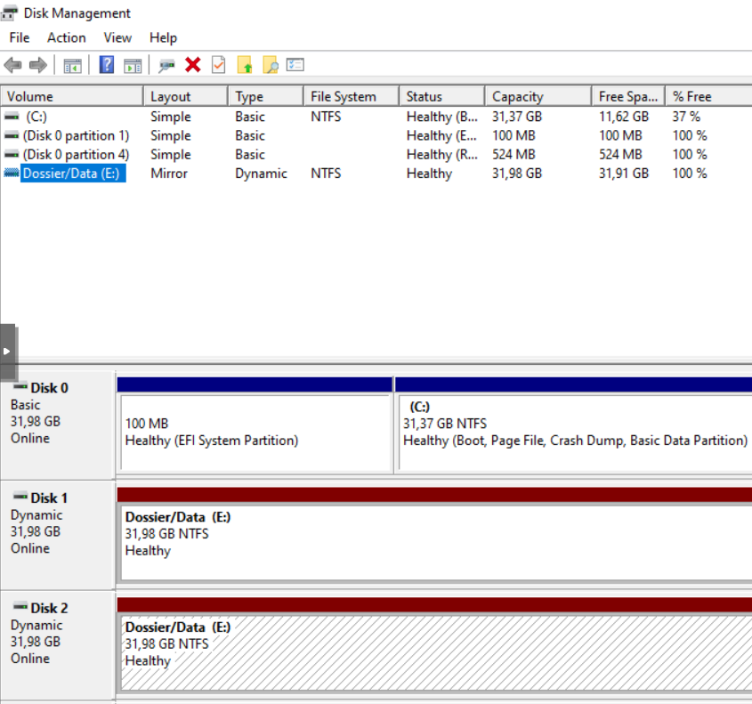

# 🖥️ Guide installation sprint 4

## Sommaire

### 1. [Installation et configuration initiale pfSense](#instal_config_pfsense)
### 2. [Mise en place de RAID 1](#raid1)
### 3. [Installation dossiers partagés](#instal_dossier_partagé)

## 1. 🧱 Installation et configuration initiale pfSense

Cette partie du guide d'installation explique comment nous avons installé et configuré notre pare-feu pfSense.

Nous créons d'abord une machine pfSense sur Proxmox. Nous utilisons pour cela l'ISO déjà présent sur l'infrastructure.

Nous ajoutons trois interfaces réseau à la machine créée :
* **vmbr1** : utilisé pour le WAN 
* **vmbr100** : utilisé pour le LAN
* **vmbr110** : utilisé pour la DMZ

L'installation de l'OS conserve les options par défaut de pfSense.

Une fois installé, nous configurons les interfaces réseau comme suit :

| Type de sortie pfSense | Nom interface Proxmox | Nom interface pfSense | Adresse réseau | Adresse IP       | Passerelle (si existence) | Rmq                  | Adresse à ne pas utiliser                                       |
| ---------------------- | --------------------- | --------------------- |-------------- | ---------------- | ------------------------- | -------------------- | --------------------------------------------------------------- |
| WAN                    | vmbr1                 | vtnet0                | 10.0.0.0/29    | 10.0.0.2/29      | 10.0.0.1                  | Ne pas changer l'@IP | Toute la plage. Si besoin demander au formateur/à la formatrice |
| LAN                    | vmbr100               | vtnet1                | 172.16.10.0/24 | 172.16.10.254/24 | -                         | Accès console web    | 172.16.10.1                                                     |
| DMZ                    | vmbr110               | vtnet2                | 172.20.10.0/24 | 172.20.10.254/24 | -                         | -                    | 172.20.10.1                                                     |

Une fois ces configurations effectuées, il est possible de se connecter à l'interface de configuration du pare-feu pfSense depuis les machines clients (ou serveurs) graphiques présentes sur le réseau. Pour cela, il faut se connecter à l'adresse *172.16.10.254* depuis son navigateur.

Ainsi, les configurations IP telles qu'elles sont dans pfSense sont comme suit :

On peut se connecter en temps qu'admin avec le compte suivant :
* **identifiant** : admin
* **mot de passe** : Azerty1*

Pour configurer les règles du pare-feu, il faut cliquer sur le menu Firewall, puis Rules : 

On peut ensuite ajouter des règles à l'aide du bouton **Add**. L'ajout de ces règles se fait ensuite à l'aide de cette interface :

Il est également possible d'ajouter des séparateurs afin de classer les règles plus facilement.

Voici un exemple de plusieurs règles telles que nous les avons créées :

La totalité des règles que nous avons implémentées ont suivi le [guide de configuration officiel de pfSense](https://docs.netgate.com/pfsense/en/latest/recipes/example-basic-configuration.html).

## 2. 📂 Mise en place de RAID 1

Cette partie du guide d'installation explique comment nous avons configuré nos disques en RAID 1.  

Le RAID 1 consiste à faire un miroir de deux disques durs. Permettant la panne de l'un d'entre eux, sans provoquer de perte de données. C'est donc notre choix ici.

D'abord, nous avons fait le choix d'avoir 3 disques de 32 Go.  

Le premier disque sera dédié à l'OS et sera réservé pour des usages ultérieurs.  

Ce sont les deux autres disques qui seront en RAID 1.

Il suffit de se rendre dans la console de gestion des disques, ou **Disk Management** en anglais.  
Click droit sur l'un des deux disques à mettre en RAID, puis **New Mirrored Volume**.  
Une fenêtre s'ouvre, après avoir cliqué sur **Next**, nous avons la possibilité de choisir quel autre disque ajouter à ce RAID 1 en sélectionnant le disque voulu puis avec **Add**. Il est aussi possible de choisir la taille à allouer. Par exemple, nous pouvons choisir d'allouer la totalité de l'espace disponible , ou au contraire de n'allouer que quelques Go. Nous avons pris la totalité de l'espace disponible. **Next**  

Il est possible de choisir une lettre associée. Nous avons choisi E pour notre volume. **Next**  
Il est ensuite possible de choisir un format de fichier. Nous avons choisi le format NTFS. **Next**  
Les deux disques passent en dynamique sous le nom **Dossier/Data (E:)**.  

Le RAID 1 est bien configuré.

## 3. 📂 Installation dossiers partagés

