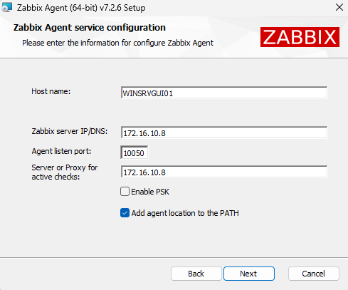
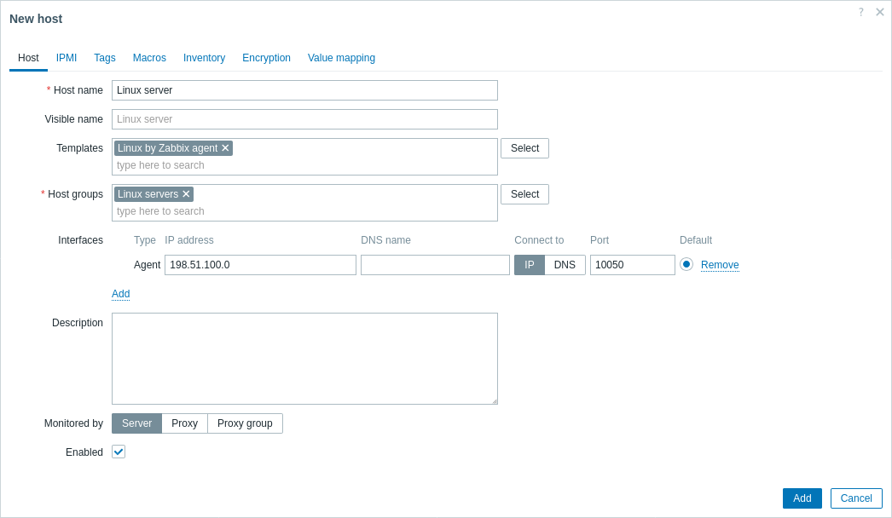

# 🖥️ Guide installation sprint 5

## 📊 Installation et configuration de Zabbix

Pour installer le gestionnaire de supervision Zabbix, une nouvelle machine virtuelle a été créée. Cette machine a pour OS Ubuntu. Elle est présente sur le réseau LAN de l'entreprise à l'adresse 172.16.10.8.

Afin de suivre les différentes machines de notre infrastructure, il faut installer Zabbix serveur sur le serveur de supervision, et Zabbix agent sur les machines à superviser.

### Zabbix serveur

https://www.zabbix.com/download?zabbix=7.2&os_distribution=ubuntu&os_version=24.04&components=server_frontend_agent&db=mysql&ws=apache

L'installation de Zabbix serveur sur Linux se fait en lignes de commandes.

Il faut tout d'abord installer le répo Zabbix :

```bash
wget https://repo.zabbix.com/zabbix/7.2/release/debian/pool/main/z/zabbix-release/zabbix-release_latest_7.2+debian12_all.deb
dpkg -i zabbix-release_latest_7.2+debian12_all.deb
apt update 
```

Puis installer Zabbix server, le front-end et l'agent :

```bash
apt install zabbix-server-mysql zabbix-frontend-php zabbix-apache-conf zabbix-sql-scripts zabbix-agent
```

On initialise la base de données de Zabbix avec les commandes suivantes :

```bash
mysql -uroot -p
password # Votre mot de passe peut changer
mysql> create database zabbix character set utf8mb4 collate utf8mb4_bin;
mysql> create user zabbix@localhost identified by 'password';
mysql> grant all privileges on zabbix.* to zabbix@localhost;
mysql> set global log_bin_trust_function_creators = 1;
mysql> quit; 
```

Puis on importe la base de données initiale :

```bash
zcat /usr/share/zabbix/sql-scripts/mysql/server.sql.gz | mysql --default-character-set=utf8mb4 -uzabbix -p zabbix 
```

On désactive ensuite l'option log_bin_trust_function_creators :

```bash
# mysql -uroot -p
password
mysql> set global log_bin_trust_function_creators = 0;
mysql> quit; 
```

On configure ensuite la base de données en modifiant le fichier _/etc/zabbix/zabbix_server.conf_ :

```bash
DBPassword=password # Votre mot de passe
```

Puis on lance le serveur Zabbix :

```bash
systemctl restart zabbix-server zabbix-agent apache2
systemctl enable zabbix-server zabbix-agent apache2 
```

L'accès au tableau de bord Zabbix peut se faire en se connectant à l'adresse _172.16.10.8_ depuis n'importe quel ordinateur.

### Zabbix agent Windows

L'installation de Zabbix agent sur Windows se fait en téléchargeant l'utilitaire d'installation [ici](https://www.zabbix.com/fr/download_agents). 

Sur une version GUI de Windows, l'installation se fait simplement en suivant les étapes de l'utilitaire d'installation. Il faut renseigner l'adresse IP du serveur (172.16.10.8) et laisser le port par défaut (10050), comme suit :



Sur une version CORE de Windows, l'utilitaire d'installation peut être téléchargé à l'aide de la commande [Invoke-WebRequest](https://learn.microsoft.com/en-us/powershell/module/microsoft.powershell.utility/invoke-webrequest?view=powershell-7.5), puis installé en laissant la commande suivante :

```powershell
msiexec.exe l*v "C:\Package.log" /i "zabbix_agent-7.2.6-windows-amd64-openssl.msi" /qn+ SERVER=172.16.10.8
```

### Zabbix agent Linux

L'installation de Zabbix agent sur Linux se fait en lignes de commandes.

Il faut tout d'abord installer le répo Zabbix :

```bash
wget https://repo.zabbix.com/zabbix/7.2/release/debian/pool/main/z/zabbix-release/zabbix-release_latest_7.2+debian12_all.deb
dpkg -i zabbix-release_latest_7.2+debian12_all.deb
apt update 
```

Puis installer Zabbix agent :

```bash
apt install zabbix-agent
```

Pour configurer l'agent, on édite le fichier de configuration : 

```bash
nano /etc/zabbix/zabbix_agentd.conf
```

En y ajoutant les lignes suivantes :

```bash
Server=172.16.10.8
ServerActive=172.16.10.8
```

Enfin, on peut relancer le service :

```bash
systemctl restart zabbix-agent
```

### Ajout d'un hôte à superviser dans Zabbix serveur

Pour que la supervision des hôtes soit active, il faut ajouter les hôtes sur lesquels sont installés Zabbix agent.

Sur le site de Zabbix, il faut aller dans _Surveillance_ puis _Hôtes_. Il est alors possible de cliquer sur _Créer un hôte_.

Il faut alors remplir la fenêtre suivante :



Il est préférable de choisir un Template cohérent avec l'hôte visé (_Linux by Zabbix agent_ ou _Windows by Zabbix agent_ dans notre cas).
Il est nécessaire de spécifier un groupe pour ce nouvel hôte.

Dans le champs IP, il faut inscrire l'adresse IP de la machine ciblée sur le réseau.

## 💾 Mise en place de sauvegarde
