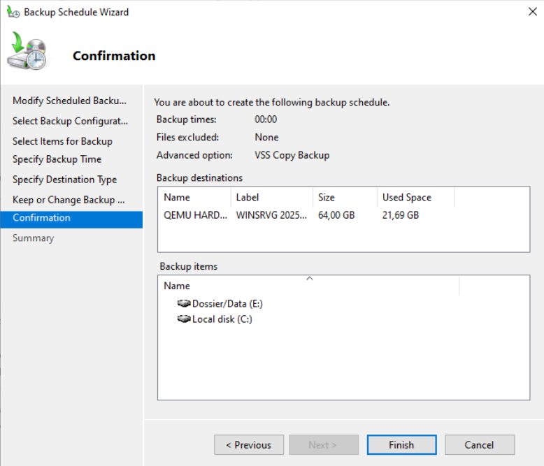
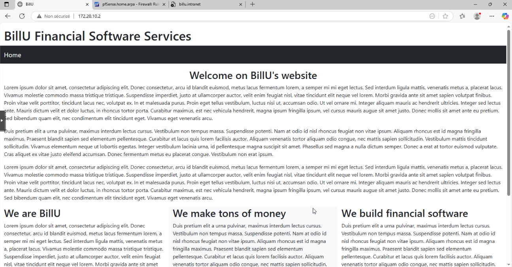

# 🖥️ Guide installation sprint 5

## Sommaire

### 1. [Installation et configuration de Zabbix](#zabbix)
### 2. [Mise en place de sauvegarde avec Windows Server Backup](#save)
### 3. [Installation d'un serveur web Apache dans un conteneur Ubuntu placé en DMZ](#install_apache)

## 📊 Installation et configuration de Zabbix
<span id="zabbix"></span>

Pour installer le gestionnaire de supervision Zabbix, une nouvelle machine virtuelle a été créée. Cette machine a pour OS Ubuntu. Elle est présente sur le réseau LAN de l'entreprise à l'adresse 172.16.10.8.

Afin de suivre les différentes machines de notre infrastructure, il faut installer Zabbix serveur sur le serveur de supervision, et Zabbix agent sur les machines à superviser.

### Zabbix serveur

L'installation de Zabbix serveur sur Linux se fait en lignes de commandes.

Il faut tout d'abord installer le répo Zabbix :

```bash
wget https://repo.zabbix.com/zabbix/7.2/release/debian/pool/main/z/zabbix-release/zabbix-release_latest_7.2+debian12_all.deb
dpkg -i zabbix-release_latest_7.2+debian12_all.deb
apt update 
```

Puis installer Zabbix server, le front-end et l'agent :

```bash
apt install zabbix-server-mysql zabbix-frontend-php zabbix-apache-conf zabbix-sql-scripts zabbix-agent
```

On initialise la base de données de Zabbix avec les commandes suivantes :

```bash
mysql -uroot -p
password # Votre mot de passe peut changer
mysql> create database zabbix character set utf8mb4 collate utf8mb4_bin;
mysql> create user zabbix@localhost identified by 'password';
mysql> grant all privileges on zabbix.* to zabbix@localhost;
mysql> set global log_bin_trust_function_creators = 1;
mysql> quit; 
```

Puis on importe la base de données initiale :

```bash
zcat /usr/share/zabbix/sql-scripts/mysql/server.sql.gz | mysql --default-character-set=utf8mb4 -uzabbix -p zabbix 
```

On désactive ensuite l'option log_bin_trust_function_creators :

```bash
# mysql -uroot -p
password
mysql> set global log_bin_trust_function_creators = 0;
mysql> quit; 
```

On configure ensuite la base de données en modifiant le fichier _/etc/zabbix/zabbix_server.conf_ :

```bash
DBPassword=password # Votre mot de passe
```

Puis on lance le serveur Zabbix :

```bash
systemctl restart zabbix-server zabbix-agent apache2
systemctl enable zabbix-server zabbix-agent apache2 
```

L'accès au tableau de bord Zabbix peut se faire en se connectant à l'adresse _172.16.10.8_ depuis n'importe quel ordinateur.

### Zabbix agent Windows

L'installation de Zabbix agent sur Windows se fait en téléchargeant l'utilitaire d'installation [ici](https://www.zabbix.com/fr/download_agents). 

Sur une version GUI de Windows, l'installation se fait simplement en suivant les étapes de l'utilitaire d'installation. Il faut renseigner l'adresse IP du serveur (172.16.10.8) et laisser le port par défaut (10050), comme suit :


Sur une version CORE de Windows, l'utilitaire d'installation peut être téléchargé à l'aide de la commande [Invoke-WebRequest](https://learn.microsoft.com/en-us/powershell/module/microsoft.powershell.utility/invoke-webrequest?view=powershell-7.5), puis installé en laissant la commande suivante :

```powershell
msiexec.exe l*v "C:\Package.log" /i "zabbix_agent-7.2.6-windows-amd64-openssl.msi" /qn+ SERVER=172.16.10.8
```

### Zabbix agent Linux

L'installation de Zabbix agent sur Linux se fait en lignes de commandes.

Il faut tout d'abord installer le répo Zabbix :

```bash
wget https://repo.zabbix.com/zabbix/7.2/release/debian/pool/main/z/zabbix-release/zabbix-release_latest_7.2+debian12_all.deb
dpkg -i zabbix-release_latest_7.2+debian12_all.deb
apt update 
```

Puis installer Zabbix agent :

```bash
apt install zabbix-agent
```

Pour configurer l'agent, on édite le fichier de configuration : 

```bash
nano /etc/zabbix/zabbix_agentd.conf
```

En y ajoutant les lignes suivantes :

```bash
Server=172.16.10.8
ServerActive=172.16.10.8
```

Enfin, on peut relancer le service :

```bash
systemctl restart zabbix-agent
```

### Ajout d'un hôte à superviser dans Zabbix serveur

Pour que la supervision des hôtes soit active, il faut ajouter les hôtes sur lesquels sont installés Zabbix agent.

Sur le site de Zabbix, il faut aller dans _Surveillance_ puis _Hôtes_. Il est alors possible de cliquer sur _Créer un hôte_.

Il faut alors remplir la fenêtre suivante :


Il est préférable de choisir un Template cohérent avec l'hôte visé (_Linux by Zabbix agent_ ou _Windows by Zabbix agent_ dans notre cas).
Il est nécessaire de spécifier un groupe pour ce nouvel hôte.

Dans le champs IP, il faut inscrire l'adresse IP de la machine ciblée sur le réseau.

## 💾 Mise en place de sauvegarde avec Windows Server Backup
<span id="save"></span>

Cette partie du guide d'installation explique comment nous avons configuré nos sauvegardes.

Pour cela, nous avons utilisé Windows Server Backup qui est un outil directement inclus à Windows Server, gratuit et simple d'utilisation.

D'abord, nous avons ajouté deux disques qui seront dédiés aux sauvegardes.  
Ces deux disques ont été mis en RAID1. Vous pouvez retrouver le guide d'installation de disques en RAID1 dans l'INSTALL.md de S04.

### Installation de Windows backup server

L'installation de la fonctionnalté se fait depuis le Server Manager; en haut de la fenêtre, on clique sur **Manage**, puis **Add roles**, **Features**, Ici on va cocher **Windows Server Backup**, puis **Install**.

### Configuration de Windows backup server

Dans le Server Manager, on va dans **Tools**, puis **Windows Server Backup** pour lancer la console.  
Sur la droite de la console, on clique sur **Backup Once** pour paramétrer une sauvegarde ponctuelle.  
On clique sur **Next**, puis **Full server** pour paramétrer une première sauvegarde. On spécifie la destination de la sauvegarde, puis on lance la sauvegarde.
**OK** au message d’erreur signalant que le lecteur Z: fait partie des éléments ciblés par la sauvegarde, et donc ne sera finalement pas pris en compte dans la sauvegarde.


On procède également à une programmation de sauvegardes récurrente.
Sur la droite de la console, on clique sur **Backup Schedule** pour paramétrer une sauvegarde programmée.  
On clique sur **Next**, puis **Custom** pour paramétrer une sauvegarde sur des des éléments précis comme le C: et le D:. On choisit ensuite la fréquence, comme **Once a day** à minuit pour éviter toute modification en cours. On préfèrera ici l'option **Backup to a hard disk that is dedicated for backups**. Il ne reste plus qu'à choisir le disque voulu, comme nous ici le Z:. On arrive enfin au récapitulatif de ce que l'on s'apprête à valider et confirmer comme on le voit ci-dessous.


Il ne reste plus qu'à valider en cliquant sur **Finish**.


## Installation d'un serveur web Apache dans un conteneur Ubuntu placé en DMZ
<span id=install_apache></span>

#### 1 -  Configurer le conteneur dans Proxmox pour etre dans la DMZ


Vérifier interface de la DMZ dans proxmox --> vmbr 110

Vérifier l'adresse de la DMZ dans pPfsense  : Firewall --> rules --> DMZ = 172.20.10.1

Mettre un ip incluse dans le réseau de la DMZ 172.20.10.0/24: --> 172.20.10.2

Gateway = ip de la DMZ --> 172.20.10.1

DNS -->  172.20.10.1 ou 8.8.8.8


- faire la mise à jours du conteneur :

        sudo apt update && sudo apt upgrade -y

#### 2 - Installation de apache

        sudo apt install apache2

        enable apache2

Vérifier le status :

        sudo systemctl status apache2


#### 3 - Test

- se connecter avec un navigateur via l'ip du conteneur.

#### 4 - Paramétrage apache 2


- créer un fichier de configuration

        touch /etc/apache2/sites-available/intranet.conf

- créer un répertoire pour les fichier du site :

        mkdir /var/www/html/intranet

- éditer le fichier :


    nano /etc/apache2/sites-available/intranet.conf

Ajouter dans le fichier

        <VirtualHost *:80>                                          --> hote virtuel, accepte les connexions venant de n'importe quelle ip sur port 80


            ServerName billu.intranet                               --> l'hote virtuel sera appelé à cette adresse
            DocumentRoot /var/www/html/intranet/                    --> les fichiers du ite seront dans ce répertoire

        <Directory /var/www/html/intranet>
            Require IP 172.16.10.0/24                               --> Accès uniquement depuis ce réseau
        </Directory>

            ErrorLog /var/log/apache2/intranet.log                  --> fichier logs / journaux

            CustomLog /var/log/apache2/intranet_access.log combined  --> fichier logs / journaux

        </VirtualHost>


- Modifier les permissions pour l'utilisateur www-data
    
        chown -R www-data:www-data /var/www/html/intranet
        chmod -R 755 /var/www/html/intranet


- activer le site 

        a2ensite intranet.conf

Le système demande d'effectuer la commande suivante :

        systemctl reload apache2

et vérifier :

        systemctl status apache 2
        apache2ctl configtest


#### 5 - Création page web

- Intégrer le contenu html dans le fichier :

        nano /var/www/html/index.html

#### 6 - Tester sur un client du domaine

- se connecter  via un navigateur sur l'ip du conteneur --> la nouvelle page s'affiche.

- Tester aussi avec l'adresse : http://billu.intranet


L'installation est terminée.



