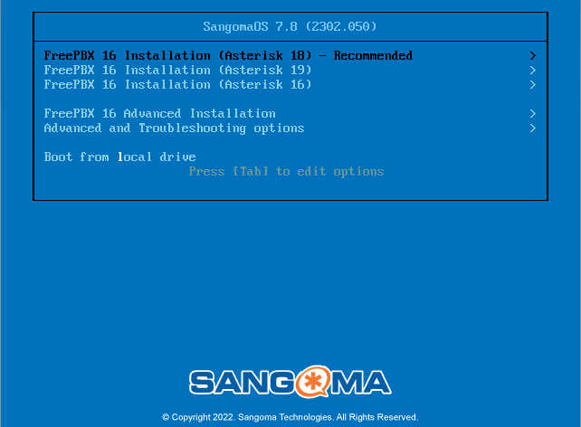
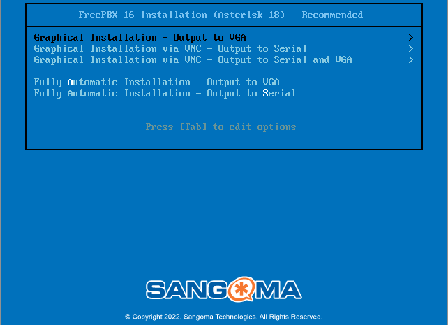
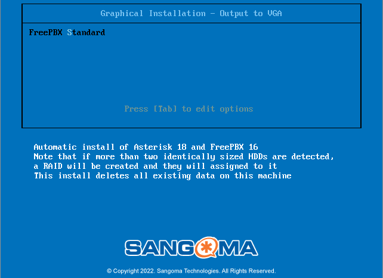
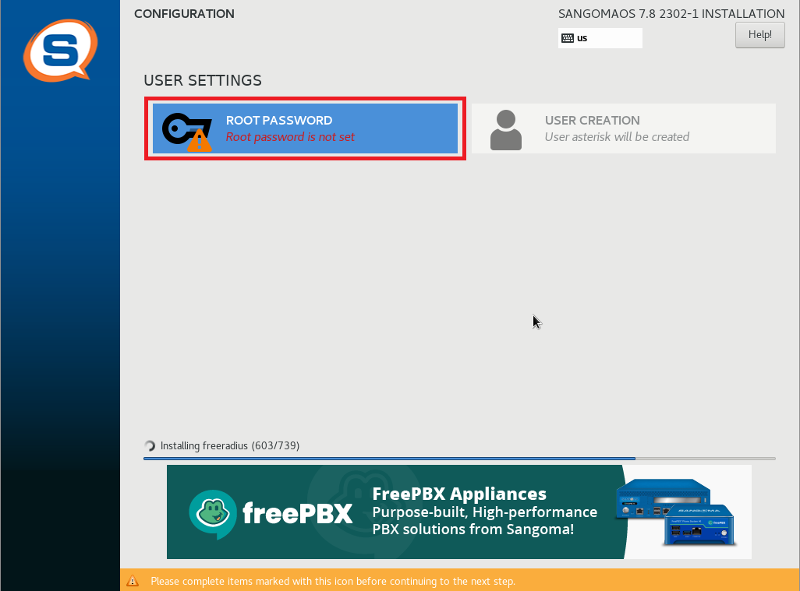

# 🖥️ Guide d'installation sprint 6

## 📞 Installation de FreePBX et 3CX

L'installation de FreePBX se fait à partir de l'ISO disponible sur le serveur Proxmox.

Nous utilisons pour cela l'iso _SNG7-PBX16-64bit-2302-1.iso_. 

### Installation de FreePBX

Une fois la VM Proxmox créée, on peut la lancer pour installer FreePBX.

On commence par choisir l'option _Recommended_ :



Puis, on choisit la _Graphical installation_ :



Enfin, on valide la seule option, _FreePBX Standard_ :



On accède alors à l'utilitaire d'installation.

Il faut configurer un mot de passe pour notre utilisateur initial root, en cliquant sur le bouton suivant :



Dans notre cas, pour assurer la compatibilité avec la disposition de clavier US/FR, nous choisissons dans un premier temps le mot de passe _free_. 

Une fois le mot de passe choisit, il n'y a plus qu'à attendre que l'installation soit terminée sur l'écran suivant :


La langue et le formatage par défaut du clavier de FreePBX est US. Nous modifions cela à l'aide des commandes suivantes :

```
localectl set-locale LANG=fr_FR.utf8
localectl set-keymap fr
localectl set-x11-keymap fr
```

### Configuration de l'IP 

Pour configurer l'adresse IP de la machine FreePBX, il faut modifier le fichier de configuration avec la commande suivante :

```
nano /etc/sysconfig/network-scripts/ifcgf-eth0
```

En modifiant la ligne `BOOTPROTO=dhcp` par `BOOTPROTO=none` et en ajoutant les lignes :

```
NETMASK=255.255.255.0
IPADDR=172.20.10.3
GATEWAY=172.20.10.254
```

Puis, on relance le service de networking avec la commande :

``` service network restart```

### Configuration comptes

On accède à l'interface de gestion de FreePBX en se connectant depuis un client à l'adresse _172.20.10.3_

Depuis le site, on peut configurer le compte admin FreePBX. Dans notre cas, le compte sera le suivant :

* **Nom de compte :** Admin
* **Mot de passe :**  Azerty1* 


### Lignes

Nous ne déployons pour l'instant que deux lignes, afin de tester la fonctionnalité 

| CLIENT | NUM | NOM | MDP |
| ----- | ----- | ---------- | -------- |
| CLI01 | 80100 | Yara Abadi | 1234 
| CLI02 | 80101 | Remi Advezekt | 1234

### Installation de 3CX Phone

https://3cxphone.software.informer.com/6.0/

Set accounts -> Ajout des comptes sur le serveur FreePBX
Check appel : nickel
