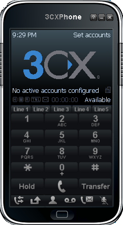
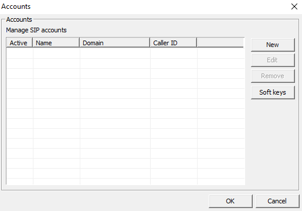

# 🖥️ Guide d'installation sprint 6

## Sommaire

### 1. [Installation de FreePBX](#Freepbx)
### 2. [Installation de 3CX Phone](#3CX)
### 3. [Installation d'un serveur iRedMail en DMZ](#iRedmail)


## 📞 Installation de FreePBX et 3CX

L'installation de FreePBX se fait à partir de l'ISO disponible sur le serveur Proxmox.

Nous utilisons pour cela l'iso _SNG7-PBX16-64bit-2302-1.iso_. 

### 1. Installation de FreePBX
<span id="Freepbx"></span>

Une fois la VM Proxmox créée, on peut la lancer pour installer FreePBX.

On commence par choisir l'option _Recommended_ :


Puis, on choisit la _Graphical installation_ :


Enfin, on valide la seule option, _FreePBX Standard_ :


On accède alors à l'utilitaire d'installation.

Il faut configurer un mot de passe pour notre utilisateur initial root, en cliquant sur le bouton suivant :


Dans notre cas, pour assurer la compatibilité avec la disposition de clavier US/FR, nous choisissons dans un premier temps le mot de passe _free_. 

Une fois le mot de passe choisit, il n'y a plus qu'à attendre que l'installation soit terminée sur l'écran suivant :


La langue et le formatage par défaut du clavier de FreePBX est US. Nous modifions cela à l'aide des commandes suivantes :

```
localectl set-locale LANG=fr_FR.utf8
localectl set-keymap fr
localectl set-x11-keymap fr
```

### Configuration de l'IP 

Pour configurer l'adresse IP de la machine FreePBX, il faut modifier le fichier de configuration avec la commande suivante :

```
nano /etc/sysconfig/network-scripts/ifcgf-eth0
```

En modifiant la ligne `BOOTPROTO=dhcp` par `BOOTPROTO=none` et en ajoutant les lignes :

```
NETMASK=255.255.255.0
IPADDR=172.20.10.3
GATEWAY=172.20.10.254
```

Puis, on relance le service de networking avec la commande :

``` service network restart```

### Configuration de compte admin

On accède à l'interface de gestion de FreePBX en se connectant depuis un client à l'adresse _172.20.10.3_

Depuis le site, on peut configurer le compte admin FreePBX. Dans notre cas, le compte sera le suivant :

* **Nom de compte :** Admin
* **Mot de passe :**  Azerty1* 


### Lignes

Nous ne déployons pour l'instant que deux lignes, afin de tester la fonctionnalité implémentée.

Les numéros de téléphone, noms et mot de passe associés à nos lignes sont les suivants :

| Client | Numéro | Nom           | Mot de passe  |
| ----- | -----   | ----------    | -------- |
| CLI01 | 80100   | Yara Abadi    | 1234 
| CLI02 | 80101   | Remi Advezekt | 1234

L'ajout d'une nouvelle ligne se fait en choissiant l'option _Applications_ puis _Extensions_ du menu :


On choisit ensuite _Add Extension_ puis l'option _SIP_ :


Enfin, on peut remplir les informations de notre utilisateur dans la fenêtre suivante :


Les informations à remplir sont :
* **User Extension** : le numéro de téléphone
* **Display Name** : le nom
* **Secret** : le mot de passe
* **Password for new user** : le mot de passe

Les autres champs peuvent être laissés vierges. Une fois que l'on a rempli les informations, on peut valider avec le bouton _Submit_.

### 2. Installation de 3CX Phone
<span id="3CX"></span>

Pour tester les lignes téléphoniques nouvellement créées, nous installons 3CX Phone sur les clients.

Le logiciel peut être téléchargé [ici](https://3cxphone.software.informer.com/6.0/).

Une fois installé, la configuration se fait de la manière suivante :

Sur l'écran du téléphone, cliquez sur Set account :



Puis sur la fenêtre listant les comptes (pour l'instant vide), cliquez sur New :



Vous aurez alors accès à la fenêtre permettant de paramétrer une ligne :


Afin de paramétrer le compte de Yara Abadi, par exemple, il faut entrer les informations suivantes :

* **Account Name :** Yara Abadi
* **Caller ID :** 80100
* **Extension :** 80100
* **ID :** 80100
* **Password :** 1234
* **I am in the office - local IP :** 172.20.10.3

Cette étape doit être répétée sur l'autre téléphone, sur un autre client, mais pour un autre utilisteur.


## 3. 📧 Installation d'un serveur iRedMail en DMZ
<span id="iRedmail"></span>

Préquis : Un domaine configuré dans Active Directory, une DMZ


### 1. Installation en DMZ

- Préparer un serveur Debian ave une IP fixe dans le réseau de la DMZ.

- Mettre le système à jour

            sudo apt update && sudo apt upgrade -y

- Renommer le serveur (par exemple : mail)

            sudo hostnamectl set-hostname mail

- Editer le fichier /etc/hosts en choisissant le FQDN du serveur mail :

            127.0.0.1   localhosts
            172.20.10.10 mail.billu.lan mail

 - Mettre le système à jour :

            sudo apt update && sudo apt upgrade -y


### 2. Paramétrage DNS dans Active DIrectory

- Dans la console DNS Manager :
    
    - Créer un enregistrement A dans la zone DMZ avec le nom et l'adresse IP du serveur Debian

    - Créer un enregistrement MX dans la zone DMZ avec le nom et l"adresse IP du serveru Debian
          Entrer le FQDN indiqué dans la configuration Debian, par exemple: mail.billu.lan


### 3. Installation du serveur mail sur le serveur Debian

- Vérifier la dernière version disponible (https://www.iredmail.org/download.html) puis installer :

            wget https://github.com/iredmail/iRedMail/archive/refs/tags/1.7.4.tar.gz

- Décompresser l'archive :

            tar xvf 1.7.4.tar.gz

- Se placer dans le répertoire contenant le fichier d'installation :

            cd iRedmail-1.7.4

- Lancer le script d'installation

            bash iRedmail.sh


### 4. Paramétrage de l'installation

Suivre le menu d"installation

- Choisir l'emplacement de stockage des emails
- Serveur web: Nginx .
- Backend: OpenLDAP.
- LDAP Suffix, par exemple : dc=mail,dc=billu,dc=lan
- Premier domaine, par exemple: mail
- Mot de passe administrateur de la base de donnée:
- Nom de domaine du premier mail, par exemple: billu.lan
- Mot de passe administrateur du premier mail:
- Composant optionnel cocher toutes les options
- Confirmation: Vérifiez les options et confirmer.

### Accès aux interfaces web

- Accès à l'interface de gestion web : https://ip_debian/iredadmin

- Pour accéder à l'interface web :  http://ip_debian/mail


L'installation du serveur est terminée.


