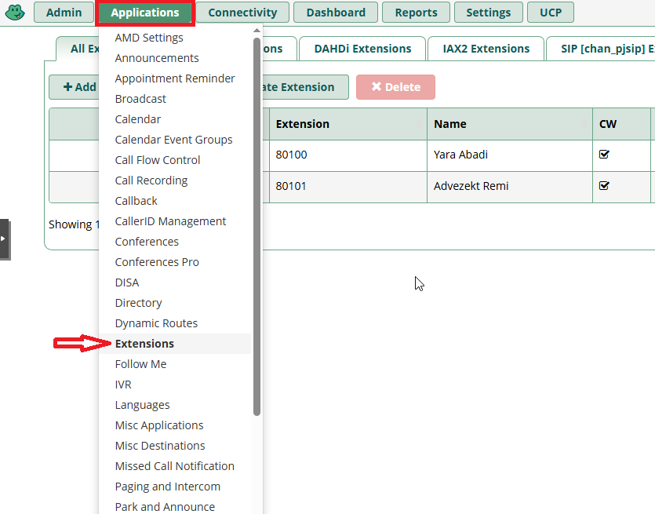
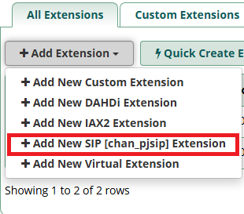
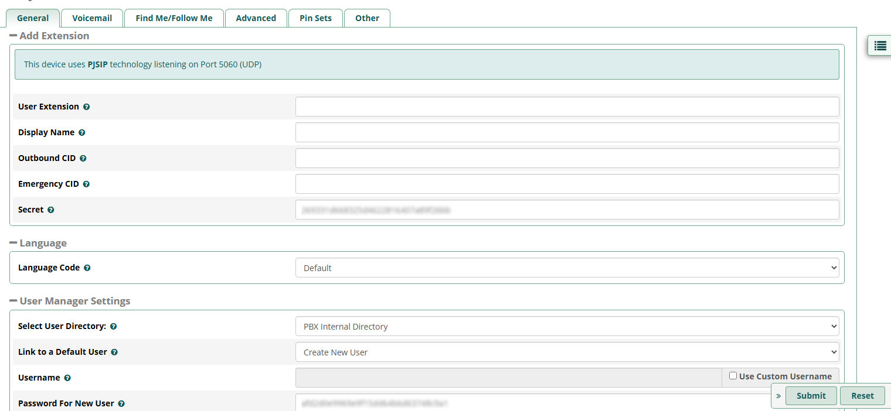

# 🖥️ Guide d'installation sprint 6

## 📞 Installation de FreePBX et 3CX

L'installation de FreePBX se fait à partir de l'ISO disponible sur le serveur Proxmox.

Nous utilisons pour cela l'iso _SNG7-PBX16-64bit-2302-1.iso_. 

### Installation de FreePBX

Une fois la VM Proxmox créée, on peut la lancer pour installer FreePBX.

On commence par choisir l'option _Recommended_ :


Puis, on choisit la _Graphical installation_ :


Enfin, on valide la seule option, _FreePBX Standard_ :


On accède alors à l'utilitaire d'installation.

Il faut configurer un mot de passe pour notre utilisateur initial root, en cliquant sur le bouton suivant :


Dans notre cas, pour assurer la compatibilité avec la disposition de clavier US/FR, nous choisissons dans un premier temps le mot de passe _free_. 

Une fois le mot de passe choisit, il n'y a plus qu'à attendre que l'installation soit terminée sur l'écran suivant :


La langue et le formatage par défaut du clavier de FreePBX est US. Nous modifions cela à l'aide des commandes suivantes :

```
localectl set-locale LANG=fr_FR.utf8
localectl set-keymap fr
localectl set-x11-keymap fr
```

### Configuration de l'IP 

Pour configurer l'adresse IP de la machine FreePBX, il faut modifier le fichier de configuration avec la commande suivante :

```
nano /etc/sysconfig/network-scripts/ifcgf-eth0
```

En modifiant la ligne `BOOTPROTO=dhcp` par `BOOTPROTO=none` et en ajoutant les lignes :

```
NETMASK=255.255.255.0
IPADDR=172.20.10.3
GATEWAY=172.20.10.254
```

Puis, on relance le service de networking avec la commande :

``` service network restart```

### Configuration de compte admin

On accède à l'interface de gestion de FreePBX en se connectant depuis un client à l'adresse _172.20.10.3_

Depuis le site, on peut configurer le compte admin FreePBX. Dans notre cas, le compte sera le suivant :

* **Nom de compte :** Admin
* **Mot de passe :**  Azerty1* 


### Lignes

Nous ne déployons pour l'instant que deux lignes, afin de tester la fonctionnalité implémentée.

Les numéros de téléphone, noms et mot de passe associés à nos lignes sont les suivants :

| Client | Numéro | Nom           | Mot de passe  |
| ----- | -----   | ----------    | -------- |
| CLI01 | 80100   | Yara Abadi    | 1234 
| CLI02 | 80101   | Remi Advezekt | 1234

L'ajout d'une nouvelle ligne se fait en choissiant l'option _Applications_ puis _Extensions_ du menu :



On choisit ensuite _Add Extension_ puis l'option _SIP_ :



Enfin, on peut remplir les informations de notre utilisateur dans la fenêtre suivante :



Les informations à remplir sont :
* **User Extension** : le numéro de téléphone
* **Display Name** : le nom
* **Secret** : le mot de passe
* **Password for new user** : le mot de passe

Les autres champs peuvent être laissés vierges. Une fois que l'on a rempli les informations, on peut valider avec le bouton _Submit_.

### Installation de 3CX Phone

Pour tester les lignes téléphoniques nouvellement créées, nous installons 3CX Phone sur les clients.

Le logiciel peut être téléchargé [ici](https://3cxphone.software.informer.com/6.0/).

Sur l'écran du SIP phone, clique sur Set account pour avoir la fenêtre Accounts.
En cliquant sur New, la fenêtre de création de compte Account settings apparaît :
Pour configurer la ligne de l'utilisatrice Marie Dupont, rentre les informations comme ceci :

    Account Name : Marie Dupont
    Caller ID : 80100
    Extension : 80100
    ID : 80100
    Password : 1234
    I am in the office - local IP : l'adresse IP du serveur soit 172.16.10.5
    

Set accounts -> Ajout des comptes sur le serveur FreePBX
Check appel : nickel
