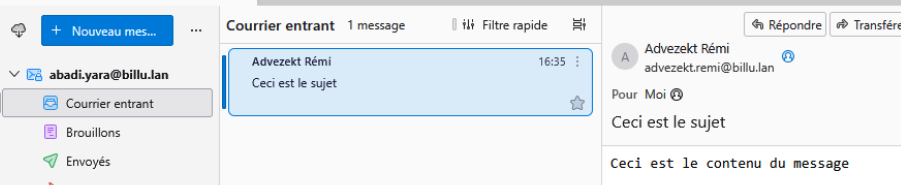
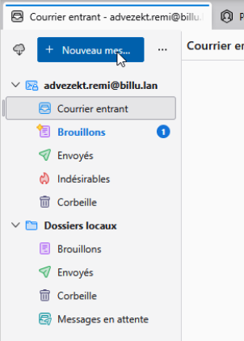
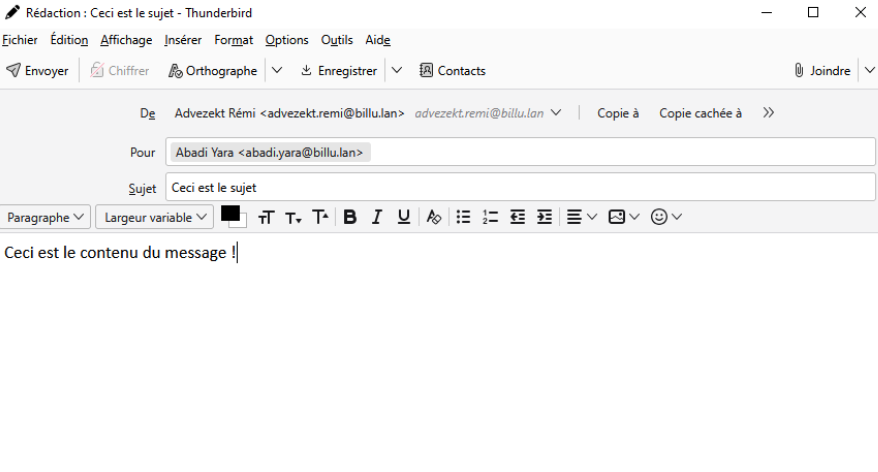
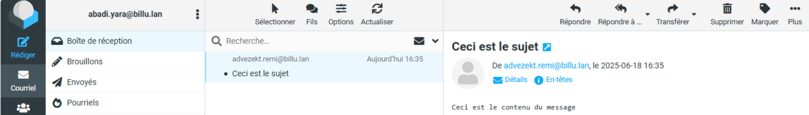
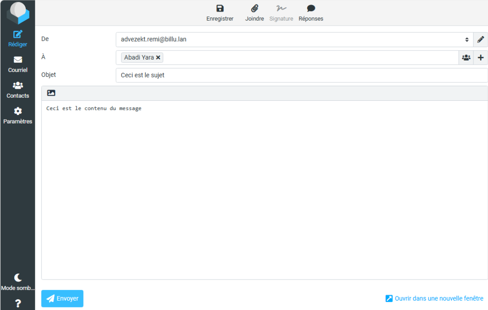

# 🖥️ Guide d'utilisation sprint 6

## Sommaire

### 1. [Téléphoner avec 3CX](#3CX)
### 2. [Envoyer un mail avec Thunderbird](#thunderbird)
### 3. [Envoyer un mail via web avec RoundCube](#roundcube)

### 1. 📞 Téléphoner avec 3CX

Une fois le client 3CX ouvert, il est possible d'appeler une ligne existante en composant le numéro souhaité. 

Par exemple, si Yara veut appeler Remi, elle peut composer son numéro :

Remi reçoit alors l'appel qu'il peut accepter ou non :

### 2. 📧 Utiliser Thunderbird comme client de messagerie

Pour ouvrir Thunderbird, executez le programme, puis authentifiez-vous avec votre identifiant, qui est l'adresse mail; et votre mot de passe correspondant.

#### Voir ses messages

Pour voir les messages reçu, une fois Thunderbird ouvret, il suffit d'aller sur **Courrier entrant** qui listera les messages réceptionnés à destination de votre adresse mail. Cliquer sur un mail l'ouvre pour dévoiler son contenu.  

#### Envoyer un nouveau message
Une fois Thunderbird ouvret, il suffit d'aller sur **Nouveau message** en haut de la fenêtre.  

Une nouvelle fenêtre s'ouvre, où on peut y renseigner des informations :
De : Précise l'expéditeur du message.
Pour : Précise le destinataire du message.
Sujet : Précise le sujet du message.  
Il est aussi possible d'ajouter des personnes en copie : ces personnes recevront également le message, mais ne seront pas les destinataires principaux.  
Et enfin, dans le grand espace de texte, le contenu du message.  
On retrouve ces informations comme ceci :  

Il ne manque plus qu'à envoyer.

### 3. 📧 Utiliser RoundCube comme client de messagerie

Sur un navigateur, aller sur l'adresse ``http://172.20.10.10/mail`` permet de s'authentifier sur RoundCube.  
Après avoir entré son identifiant qui est son adresse mail, sous format ``nom.prenom@billu.lan``, et entré son mot de passe correspondant; on accède à sa boîte mail.

#### Voir ses messages
Pour voir les messages reçu, il suffit d'aller sur **Courriel** dans le menu à gauche, puis dans **Boîte de réception**. Ici seront listés les messages réceptionnés. Cliquer sur un mail l'ouvre pour dévoiler son contenu. 

#### Envoyer un nouveau message
Pour envoyer un mail, il suffit d'aller sur **Rédiger** dans le menu à gauche.

Plusieurs champs sont à renseigner:

De : Précise l'expéditeur du message.
À : Précise le destinataire du message.
Objet : Précise le sujet du message.  
Il est aussi possible d'ajouter des personnes en copie : ces personnes recevront également le message, mais ne seront pas les destinataires principaux.  
Et enfin, dans le grand espace de texte, le contenu du message.  
On retrouve ces informations comme ceci :  

Il ne manque plus qu'à envoyer.
