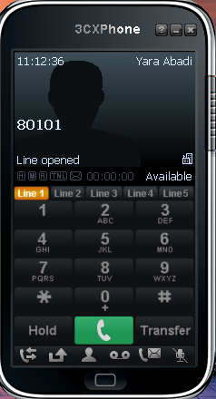

# 🖥️ Guide d'utilisation sprint 6

## 📞 Téléphoner avec 3CX

Une fois le client 3CX ouvert, il est possible d'appeler une ligne existante en composant le numéro souhaité. 

Par exemple, si Yara veut appeler Remi, elle peut composer son numéro :

