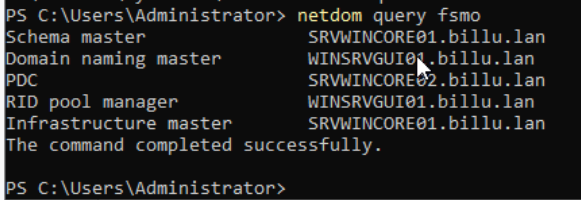

# Guide d'installation Sprint 7

## 📜 Sommaire

### 1. [Distribution des rôles FSMO](#fsmo)
### 2. [PC d'administration](#admin)
### 3. [Serveur de gestion de mises à jour WSUS](#wsus)

## 🎭 Distribution des rôles FSMO
<span id="fsmo"></span>

Afin de distribuer les rôles FSMO, nous allons créer une nouvelle machine Windows Server Core.

Les rôles seront répartis de la manière suivante entre nos 3 machines :

| Rôle | Machine |
| ---- | ---- | 
| RID Master | WINSRVGUI01 |
| Domain Naming Master | WINSRVGUI01 |
| Infrastructure Master | WINSRVCORE01 |
| Schema Master | WINSRVCORE01 |
| PDC | WINSRVCORE02 |


### Création d'un nouveau Windows Server Core

Pour la machine Windows Server Core, nous avons fait un clone de la machine template Windows Server Core sur Proxmox.

#### Réseau

- Configuration IP du serveur Windows Core  

`New-NetIPAddress -InterfaceAlias "Ethernet" -IPAddress "172.16.10.5" -PrefixLength 24 -DefaultGateway "172.16.10.254"`

- Paramétrage du DNS via le choix n°8 dans le menu du serveur.

Nous avons ajouté l'IP du contrôleur de domaine en DNS principal soit : 

`172.16.10.1`

En DNS secondaire nous avons indiqué la boucle locale du Windows Server Core

`127.0.0.1`

#### Intégration au domaine billu.lan 

L'ajout a été fait via le controleur de domaine sur Windows Server Core.

### Transfert des rôles avec NTDSUTIL

Pour transférer les rôles FSMO aux différents contrôleurs du domaine, nous utilisons l'utilitaire NTDSUTIL.

Lancez l'utilitaire en tapant la commande suivante dans PowerShell :

```powershell
ntdsutil.exe
```

Une fois l'utilitaire lancé, nous passons en mode **fsmo maintenance** avec la commande suivante :

```powershell
role
```

Pour transférer des rôles à un contrôleur de domaine spécifique, nous entrons dans le mode **connections** :

```powershell
connections
```

Puis nous établissons la connection au serveur **WINSRVCORE01** :

```powershell
connect to server WINSRVCORE01
```

On peut alors sortir de ce mode :

```powershell
q
```

Une fois revenus au mode **fsmo maintenance**, nous transférons les droits **Schema Master** et **Infrastructure Master** à **SRVWINCORE01** à l'aide des commandes suivantes :

```powershell
transfer schema master
```

```powershell
transfer infrastructure master
```

Nous pouvons désormais transferer le rôle **PDC** à **SRVWINCORE02**.

Pour transférer des rôles à un contrôleur de domaine spécifique, nous entrons dans le mode **connections** :

```powershell
connections
```

Puis nous établissons la connection au serveur **WINSRVCORE02** :

```powershell
connect to server WINSRVCORE02
```

On peut alors sortir de ce mode :

```powershell
q
```

Et enfin, nous lui transférons le rôle **PDC** :

```powershell
transfer pdc
```

On peut sortir de l'utilitaire NTDSUTIL en répétant la commande suivante :

```powershell
q
```

Une fois sortis de cet utilitaire, nous vérifions que la distribution des rôles est bien faite avec la commande :

```powershell
netdom query fsmo
```

Ce qui doit nous donner le résultat suivant :



## 🖥️ PC d'administration
<span id="admin"></span>


## 🛠️ Serveur de gestion de mises à jour WSUS
<span id="wsus"></span>

Afin de gérer les mises à jour à l'aide de WSUS, nous allons créer une nouvelle machine Windows Server Core.

Son addresse sur le serveur sera _172.16.10.9_

### Création d'un nouveau Windows Server Core

Pour la machine Windows Server Core, nous avons fait un clone de la machine template Windows Server Core sur Proxmox.

#### Réseau

- Configuration IP du serveur Windows Core  

`New-NetIPAddress -InterfaceAlias "Ethernet" -IPAddress "172.16.10.9" -PrefixLength 24 -DefaultGateway "172.16.10.254"`

- Paramétrage du DNS via le choix n°8 dans le menu du serveur.

Nous avons ajouté l'IP du contrôleur de domaine en DNS principal soit : 

`172.16.10.1`

En DNS secondaire nous avons indiqué la boucle locale du Windows Server Core

`127.0.0.1`

#### Intégration au domaine billu.lan 

L'ajout a été fait via le controleur de domaine sur Windows Server Core.

### Ajout du rôle WSUS

L'ajout du rôle WSUS se fait via l'utilitaire d'ajout de rôles, depuis notre serveur en GUI.

Nous suivons les instructions de l'utilitaire d'ajout de rôle sans modifier les options préconisées.

Le dossier de stockage des mises à jour de WSUS est `C:\WSUS`.

### Configuration de WSUS

https://www.stephenwagner.com/2019/05/15/guide-using-installing-wsus-windows-server-core-2019/

La configuration de WSUS se fait depuis le PC d'administration sur lequel nous avons installé RSAT.
