# Guide d'installation Sprint 7

## 📜 Sommaire

### 1. [Distribution des rôles FSMO](#fsmo)
### 2. [PC d'administration](#admin)
### 3. [Serveur de gestion de mises à jour WSUS](#wsus)
### 4. [Installation Serveur GLPI et Liaison à l'Active Directory](#GLPI/Active_Directory)

## 🎭 Distribution des rôles FSMO
<span id="fsmo"></span>

Afin de distribuer les rôles FSMO, nous allons créer une nouvelle machine Windows Server Core.

Les rôles seront répartis de la manière suivante entre nos 3 machines :

| Rôle | Machine |
| ---- | ---- | 
| RID Master | WINSRVGUI01 |
| Domain Naming Master | WINSRVGUI01 |
| Infrastructure Master | WINSRVCORE01 |
| Schema Master | WINSRVCORE01 |
| PDC | WINSRVCORE02 |


### Création d'un nouveau Windows Server Core

Pour la machine Windows Server Core, nous avons fait un clone de la machine template Windows Server Core sur Proxmox.

#### Réseau

- Configuration IP du serveur Windows Core  

`New-NetIPAddress -InterfaceAlias "Ethernet" -IPAddress "172.16.10.5" -PrefixLength 24 -DefaultGateway "172.16.10.254"`

- Paramétrage du DNS via le choix n°8 dans le menu du serveur.

Nous avons ajouté l'IP du contrôleur de domaine en DNS principal soit : 

`172.16.10.1`

En DNS secondaire nous avons indiqué la boucle locale du Windows Server Core

`127.0.0.1`

#### Intégration au domaine billu.lan 

L'ajout a été fait via le controleur de domaine sur Windows Server Core.

### Transfert des rôles avec NTDSUTIL

Pour transférer les rôles FSMO aux différents contrôleurs du domaine, nous utilisons l'utilitaire NTDSUTIL.

Lancez l'utilitaire en tapant la commande suivante dans PowerShell :

```powershell
ntdsutil.exe
```

Une fois l'utilitaire lancé, nous passons en mode **fsmo maintenance** avec la commande suivante :

```powershell
role
```

Pour transférer des rôles à un contrôleur de domaine spécifique, nous entrons dans le mode **connections** :

```powershell
connections
```

Puis nous établissons la connection au serveur **WINSRVCORE01** :

```powershell
connect to server WINSRVCORE01
```

On peut alors sortir de ce mode :

```powershell
q
```

Une fois revenus au mode **fsmo maintenance**, nous transférons les droits **Schema Master** et **Infrastructure Master** à **SRVWINCORE01** à l'aide des commandes suivantes :

```powershell
transfer schema master
```

```powershell
transfer infrastructure master
```

Nous pouvons désormais transferer le rôle **PDC** à **SRVWINCORE02**.

Pour transférer des rôles à un contrôleur de domaine spécifique, nous entrons dans le mode **connections** :

```powershell
connections
```

Puis nous établissons la connection au serveur **WINSRVCORE02** :

```powershell
connect to server WINSRVCORE02
```

On peut alors sortir de ce mode :

```powershell
q
```

Et enfin, nous lui transférons le rôle **PDC** :

```powershell
transfer pdc
```

On peut sortir de l'utilitaire NTDSUTIL en répétant la commande suivante :

```powershell
q
```

Une fois sortis de cet utilitaire, nous vérifions que la distribution des rôles est bien faite avec la commande :

```powershell
netdom query fsmo
```

Ce qui doit nous donner le résultat suivant :

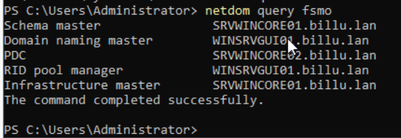

## 🖥️ PC d'administration
<span id="admin"></span>


### Pour l'Administration  des serveurs Windows

#### 1. Installer RSAT

Non disponible en version graphique sur notre version windows 10 PRO --> installation avec Powershell

            Get-WindowsCapability -Name "RSAT*" -Online | Add-WindowsCapability -Online

#### 2. Activation de RDP

        Set-ItemProperty -Path "HKLM:\System\CurrentControlSet\Control\Terminal Server" -Name "fDenyTSConnections" -Value 0

### 3. Remote powershell

- le pare-feu doit être désactivé

- activer winRM

        Enable-PSRemoting   
        
        ( ou  Enable-PSRemoting -f )


- Redémarrer le service :

        Restart-Service winrm

- Tester la connection :

        Enter-PSSession -ComputerName WINSRVGUI01 -credential (Get-Credential)

  Entrer ID + mdp


#### 4. Serveur RDP

- Ajouter le rôle : Remote Desktop Service

- Dans "Select Role Service" cocher : Remote Desktop Gateway

- Redémarrer le serveur après l'installation

- Ouvrir la console Remote Gateway Manager (dispo dans Tools--> Remote Desktop Services )

- Configurer les règles de RD Gateway: 

- Cliquer sur Create New Authorization Policy 
     --> Create New --> donner un nom (RD-ADMIN) -->ajouter le groupe qui aura accès-->DSI --> Ressources authorisation policy = RD-ADMIN --> Dans Network ressources = cocher allow all users... -->  Terminer

- Création d'un certifcat autosigné

  - Sélectionner le serveur en haut à gauche
  - clic droit --> properties --> SSL Certificate --> Create a self-signed certificate
  - choisir le chemin ou sera stocké le certificat


- Vérifier la création dans la console "Services"
- Double clic sur le certificat : startup type = Automatic
 
- Connexion depuis le pc d admninistration

   Récupérer le certificat via un dossier partager et l'importer
   Cliquer sur installer le certificat --> cliquer ordinateur local
   --> placer tous les certificats dans le magasin de confiance --> terminer

- Se connecter avec RDP

   - Onglet "Avancé" --> Paramètres --> Nom du serveur passerelle (Serveur AD) --> cocher les 2 cases--> terminer

   - Dans l'onglet "Général" rentrer les infos de connexion :  ip du serveur cible + nom d"'utilisateur (BIllu\Administrator)


#### 5. Suite Sysinternals

- Télécharger la suite  ici : https://download.sysinternals.com/files/SysinternalsSuite.zip

- Faire l'installation du fichier .exe

### Pour l'administration des PC Linux

#### 1. Installation de Gitbash : 

  https://git-scm.com/downloads  

#### 2. Installation de Putty

  www.chiark.greenend.org.uk/~sgtatham/putty/

#### 3.  Installation de Wincscp

https://winscp.net/eng/docs/guide_install

#### 4. Installation de WSL

- Entrer la ligne de commande

        wsl --install

- Redémarrer le serveur

#### 5. Installation de Rustdesk (prise en main à distance GUI)

- se rendre sur  :

https://github.com/rustdesk/rustdesk/releases/tag/1.4.0

- Choisir le paquet .msi et l'installer

- Faire une GPO ordinateurs dans AD pour l'installer sur les autres machine du domaine.

- Connecter les machines avec les identifiants affichés


## 🛠️ Serveur de gestion de mises à jour WSUS
<span id="wsus"></span>

Afin de gérer les mises à jour à l'aide de WSUS, nous allons créer une nouvelle machine Windows Server.

Son addresse sur le serveur sera _172.16.10.11_

### Création d'un nouveau Windows Server

Pour la machine Windows Server Core, nous avons fait un clone de la machine template Windows Server Core sur Proxmox.

#### Réseau

L'adresse IP fixe de ce nouveau serveur est _172.16.10.11_. 

Il faut penser à également configurer le DNS préféré (_172.16.10.1_) afin de l'intégrer convenablement au domaine.

#### Intégration au domaine billu.lan 

L'ajout a été fait via le controleur de domaine sur Windows Server Core.

### Ajout du rôle WSUS

L'ajout du rôle WSUS se fait via l'utilitaire d'ajout de rôles.

Nous suivons les instructions de l'utilitaire d'ajout de rôle sans modifier les options préconisées.

Le dossier de stockage des mises à jour de WSUS est `E:\WSUS'.

### Configuration de WSUS

Dans la console WSUS, nous créons trois groupes pour gérer nos mises à jour : **DC**, **Serveurs** et **Clients**. Ainsi, les politiques de mise à jour seront différentes en fonction des machines.

#### Configuration par GPO

Afin d'implémenter nos stratégies de mise à jour, nous devons créer 3 GPOs :
* WSUS - Clients
* WSUS - Serveurs
* WSUS - DC

Le paramétrage ci-dessous est commun à toutes les GPO :

Dans **Specify intranet Microsoft update service location** :
 * Cocher **Enabled**
 * Dans les options, pour les 2 premiers champs, mettre l'URL avec le nom du serveur sous sa forme FQDN, ajouter le numéro du port 8530, soit _http://winservgui02.bllu.lan:8530_
 * Valider la configuration

Dans **Do not connect to any Windows Update Internet locations** :
 * Cocher **Enabled** et valider la configuration

##### WSUS - Clients

Dans **Configure automatic updates** :
* Cocher **Enabled**
* Sélectionner **4 - Auto download and schedule the install**
* Sélectionner **Everyday**
* Sélectionner **12:00**
* Valider

##### WSUS - Serveurs

Dans **Configure automatic updates** :
* Cocher **Enabled**
* Sélectionner **3 - Auto download and notify for install**
* Sélectionner **Everyday**
* Sélectionner **3:00**
* Valider

##### WSUS - DC

Dans **Configure automatic updates** :
* Cocher **Enabled**
* Sélectionner **7 - Auto download, notify for install, notify to restart**
* Sélectionner **Everyday**
* Sélectionner **3:00**
* Valider

## 🛠️ Installation Serveur GLPI et Liaison à l'Active Directory
<span id="GLPI/Active_Directory"></span>

### 1.Installation d'un serveur GLPI sur le serveur Debian

**<ins>Pré requis:</ins>**
- Un serveur: Ici, nous avons pris un conteneur sous Debian avec une adresse Ip 172.16.10.12/24
- Un serveur AD: Ici, nous avons pris une Windows server avec une adresse IP 172.16.10.1/24

**<ins>Commandes pour l'installation sur le serveur Debian:</ins>**

- Mises à jour du serveur `apt update && apt upgrade -y`
- Installation Apache `apt install apache2 -y`
- Activation d'Apache maintenant et au démarrage de la machine `systemctl enable --now apache2`
- Vérification du status d'Apache `systemctl status apache2` il doit être en vert "Running"
- Installation de la BDD mariahdb `apt install mariadb-server -y`
- PHP: Installation des dépendances `apt install ca-certificates apt-transport-https software-properties-common lsb-release curl lsb-release -y`
- Ajout du dépôt pour PHP 8.1 : `wget -qO /etc/apt/trusted.gpg.d/php.gpg https://packages.sury.org/php/apt.gpg`, puis `echo "deb https://packages.sury.org/php/ $(lsb_release -sc) main" | sudo tee /etc/apt/sources.list.d/php.list` et enfin `curl -sSL https://packages.sury.org/php/README.txt | bash -x`
- Mise à jour `apt update`
- Installation de PHP 8.1 `apt install php8.1 -y`
- Installation des modules annexes `apt install php8.1 libapache2-mod-php -y` et `apt install php8.1-{ldap,imap,apcu,xmlrpc,curl,common,gd,mbstring,mysql,xml,intl,zip,bz2} -y`
- Installation de Mariadb `mysql_secure_installation`
  > A la suite de cette commande, plusieurs questions vous seront posées comme **Mot de passe du compte root?** ou encore **changer le mot de passe du compte root?** A répondre selon ce que vos besoins.
- Configuration de la base de données `mysql -u root -p`
- Dans la configuration de Mariadb, nous avons mis  
  > Nom de la BDD : glpidb
  - `create database glpidb character set utf8 collate utf8_bin;`
  > - Compte d accès à la BDD glpidb : glpi
  > - Mot de passe du compte glpi : Azerty1*
  - `grant all privileges on glpidb.* to glpi@localhost identified by "Azerty1*";`
  - `flush privileges;`
  - `quit`
  -  Ressources de GLPI dans Github / Téléchargement des sources `wget https://github.com/glpi-project/glpi/releases/download/10.0.18/glpi-10.0.18.tgz`
  -  Création du dossier pour glpi `mkdir /var/www/html/glpi.billu.lan` (Mettre votre nom de domaine AD)
  -  Décompression du contenu téléchargé `tar -xzvf glpi-10.0.18.tgz`
  -  Copie du dossier décompréssé vers le nouveau crée `cp -R glpi/* /var/www/html/glpi.billu.lan`
  -  Suppression du fichier index.php dans /var/www/html `rm /var/www/html/index.html`
  -  Mettre les droits nécessaires aux fichiers `chown -R www-data:www-data /var/www/html/glpi.billu.lan` et `chmod -R 700 /var/www/html/glpi.billu.lan` (Mettre selon vos besoins)
  -  La version php8.4 n'étant actuellement aps compatible avec apache2, nous allons désactiver cette version `a2dismod php8.4` et bien activer la version php8.1 `a2enmod php8.1` 
  -  Configuration de PHP / Editer du fichier /etc/php/8.1/apache2/php.ini `nano /etc/php/8.1/apache2/php.ini`
  > - Modification des paramètres -> memory_limit = 64M # <= à changer #vers ligne 435
  > - Max_execution_time = 600 # <= à changer #vers ligne 409
  - Enregistrer et quitter
  - Redémarrer le serveur.
  - - **Pour la liaison** -> Tapez les commandes `sudo apt-get update`  

### Sur la machine cliente Windows server

Depuis le navigateur web: http://172.16.10.12/glpi.billu.lan/ (Mettre l'adresse de sons serveur GLPI)

Sur la page d'installation :
- Langue : **Français**
- Cliquer sur **Installer**
- Corriger éventuellement les **requis**

Pour le SETUP :
- Serveur SQL : 127.0.0.1
- Utilisateur : glpi
- Mot de passe : Azerty1*

Choisir la base de données créer : glpidb

A la fin, vous tomberez sur cette page internet
- Identifiant: glpi
- MDP: glpi
Pour le mode "super administrateur"

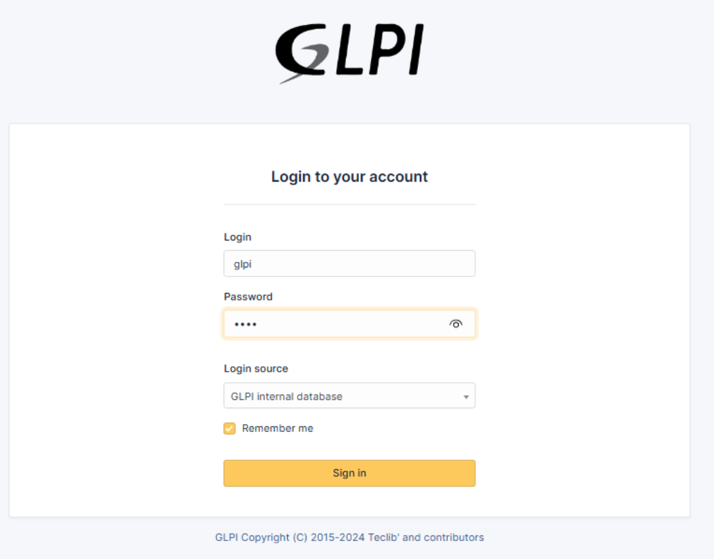

### 2.Liaison à l'Active Directoy

<ins>Pré-requis</ins> Créer une **OU** dans l'Active Directory nommée **Connecteurs** avec un utilisateur comme par exemple **Synchro_GLPI** qui vous servira de lien avec votre Annnuaire LDAP. Ne pas le mettre avec des droits Administrateur.

- Aller dans Configuration et Authentification

 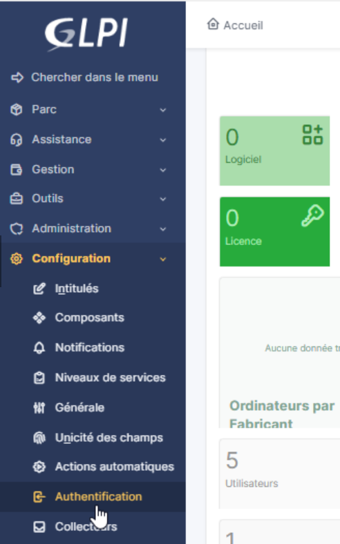

- Annuaire LDAP

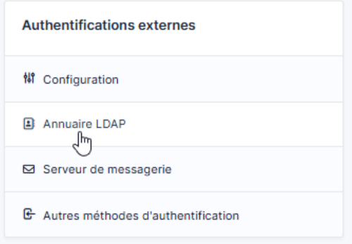

- Ajouter

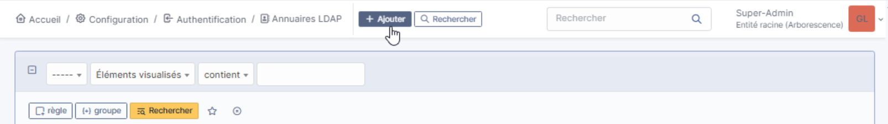

- Et on tombe sur "Nouvel élément - Annuaire LDAP"

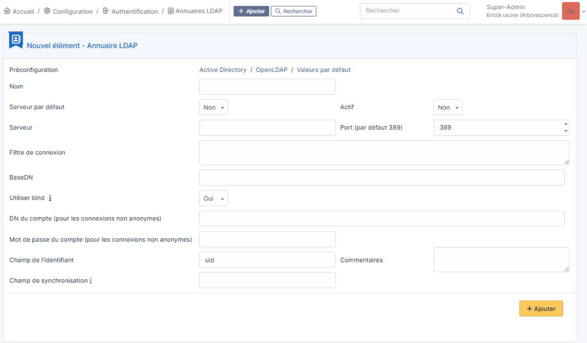

- Remplir l'annuaire
> - En haut de page on a "Active directory / OpenLDAP / Valeurs par défaut" -> Cliquer sur Active Directory et une ligne va apparaître dans le filtre de connexion.
> - Nom : le nom de cet annuaire LDAP
> - Serveur par défaut: oui
> - Actif : oui
> - Serveur : adresse IP du contrôleur de domaine à interroger: ici 172.16.10.1
> - Port : 389, qui est le port par défaut du protocole LDAP
> - Filtre de connexion : requête LDAP pour rechercher les objets dans l'annuaire Active Directory
- elle veut dire:
> - 👉 Je veux tous les objets qui sont des utilisateurs
> - 👉 Qui sont des personnes (et pas des ordinateurs)
> - 👉 Et qui ne sont pas désactivé


> - BaseDN : où faut-il se positionner dans l'annuaire pour rechercher les utilisateurs ? ici OU=Utlisateurs,OU=Billu,DC=billan,DC=lan
> - Utiliser bind : à positionner sur "Oui" pour du LDAP classique (sans TLS)
> - DN du compte : le nom du compte à utiliser pour se connecter à l'Active Directory: ici CN=Synchro_GLPI,OU=Connecteurs,DC=billu,DC=lan
> - Mot de passe du compte : le mot de passe du compte renseigné ci-dessus
> - Champ de l'identifiant : UserPrincipalName ou SamAccountName (selon vos besoins)
> - Champ de synchronisation : GLPI a besoin d'un champ sur lequel s'appuyer pour synchroniser les objets: ici objectguid pour avoir une valeur unique de chaque utilisateurs.

A la fin, vous devez avoir quelque chose qui ressemble à ça

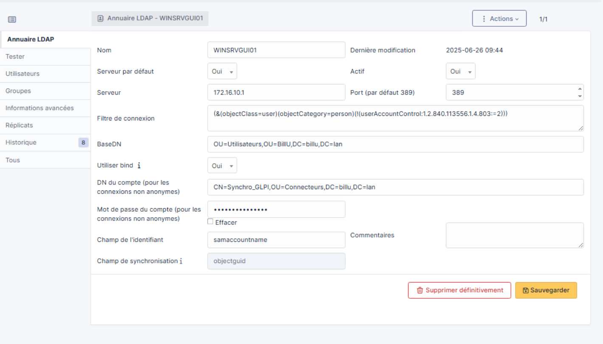

> - Ajouter ou Sauvegarder les changements si l'annuaire LDAP etait déjà créée

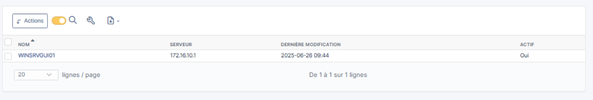

Vous pouvez tester la connection en cliquant sur le nom de votre serveur

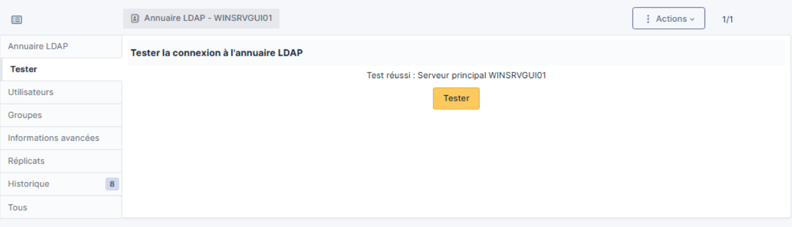

Voilà, votre serveur Active Directory et lié à votre Annuaire LDAP !

Pour importer les utilisateurs, aller dans **Administration**, **Utilisateurs** puis **Liaison annuaire LDAP**.  
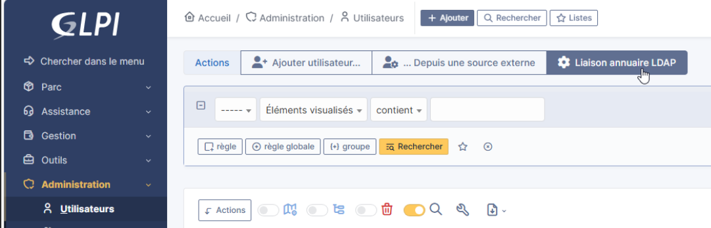


**Importation de nouveaux utilisateurs** puis **Rechercher** pour ne pas appliquer de filtre et ainsi afficher tous les utilisateurs.  
Sélectionner tous les utilisateurs puis **Actions**  
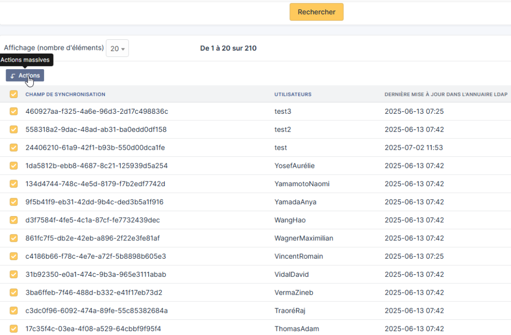  

Choisir **Importer** et Envoyer

De retour dans **Administration**, **Utilisateurs**, on peut vérifier l'import des utilisateurs.  
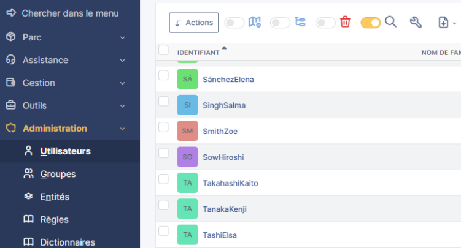  

Pour mettre en place la synchronisation des utilisateurs, retourner dans **Administration**, **Utilisateurs** puis **Liaison annuaire LDAP**.  
Choisir **Synchronisation des utilisateurs déjà importés** puis **Rechercher** pour ne pas appliquer de filtre et ainsi afficher tous les utilisateurs.  
Sélectionner tous les utilisateurs puis **Actions**. Choisir **Synchroniser** et Envoyer.  


