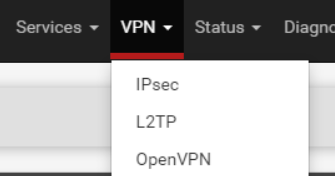
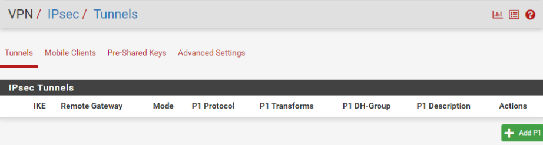
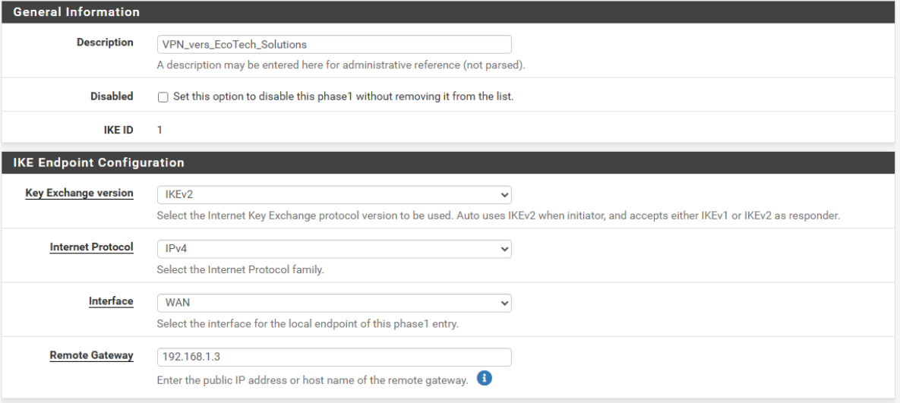
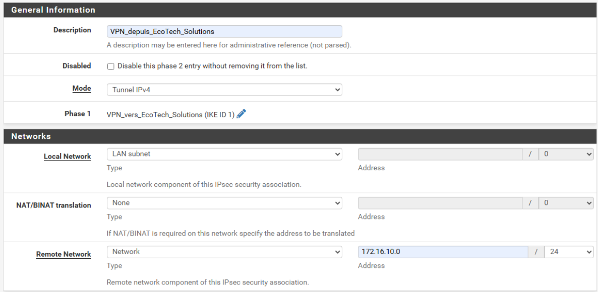
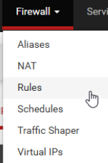
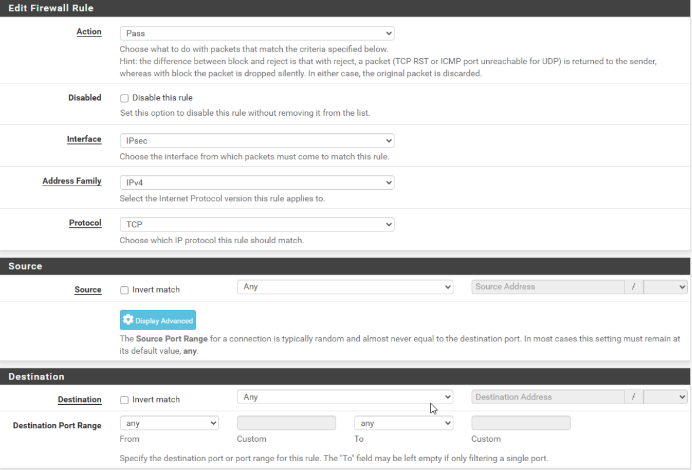
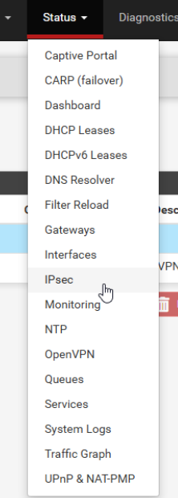
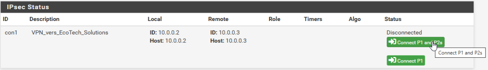
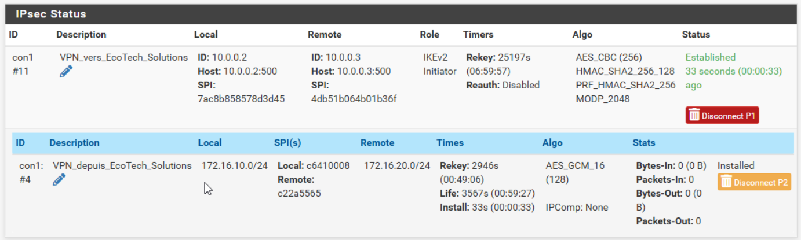

Partenariat : 2 objectifs de groupe à choisir. 1 Principal et 1 Secondaire. 3 objectifs communs à choisir : 2 Principaux et 1 Secondaire.

### 1. [Installation Guacamole (Serveur bastion)](#guacamole)
### 2. [Mise en place d'un VPN site à site](#VPN_site2site)
### 3. [Mise en place d'une connection RDS](#RDS)
### 4. [Accès au Firewall partenaire](#Firewall)

### 1. Installation Guacamole (Serveur bastion)

####    1.1 Guacamole  Server

- Installer les dépendances

            apt-get install build-essential libcairo2-dev libjpeg62-turbo-dev libpng-dev libtool-bin uuid-dev libossp-uuid-dev libavcodec-dev libavformat-dev libavutil-dev libswscale-dev freerdp2-dev libpango1.0-dev libssh2-1-dev libtelnet-dev libvncserver-dev libwebsockets-dev libpulse-dev libssl-dev libvorbis-dev libwebp-dev

- Téléchager la dernière version de Guacamole

            wget https://downloads.apache.org/guacamole/1.6.0/source/guacamole-server-1.6.0.tar.gz

- Décompresser l'archive:

            tar -xzf guacamole-server-1.6.0.tar.gz
            cd guacamole-server-1.6.0/

- Préparer la commande et vérifier les dépendances

            ./configure --with-systemd-dir=/etc/systemd/system/

- Compiler

            make
            make install

- mettre à jour les lien et les librairies

            ldconfig

- Démarrer le service "guacd" et l'activer au démarrage

            systemctl daemon-reload
            systemctl enable --now guacd

- vérifier le status :

            systemctl status guacd

- Créer le répertoire de configuration

            mkdir -p /etc/guacamole/{extensions,lib}

####    1.2 Guacamole client

- Ajouter un nouveau fichier source pour Apt :

            nano /etc/apt/sources.list.d/bullseye.list 

    entrer cette ligne dans le fichier :

            deb http://deb.debian.org/debian/ bullseye main
    
            apt update

- Installer Tomacat

            apt-get install tomcat9 tomcat9-admin tomcat9-common tomcat9-user

- Télecharger la Web App d'Apache Guacamole

            cd /tmp
            wget https://downloads.apache.org/guacamole/1.6.0/binary/guacamole-1.6.0.war

- Déplacer le fichier dans Tomcat 9

            guacamole-1.5.5.war /var/lib/tomcat9/webapps/guacamole.war

- Relancer le service

            mv guacamole-1.5.5.war /var/lib/tomcat9/webapps/guacamole.war

####    1.3 Installation de Maria DB

- Entrer les commandes :

            apt-get install mariadb-server

- Initialiser le mot de passe de la BDD

            mysql_secure_installation

- Se connecter en tant que root de la base de donnée

            mysql -u root -p

- Créer la base de données

            CREATE DATABASE guacadb;
            CREATE USER 'guaca_nachos'@'localhost' IDENTIFIED BY 'P@ssword!';
            GRANT SELECT,INSERT,UPDATE,DELETE ON guacadb.* TO 'guaca_nachos'@'localhost';
            FLUSH PRIVILEGES;
            EXIT;

- Ajouter l'extension MySQL à Apache Guacamole

            cd /tmp
            wget https://downloads.apache.org/guacamole/1.6.0/binary/guacamole-auth-jdbc-1.6.0.tar.gz

- Décompresser l'archive :

            tar -xzf guacamole-auth-jdbc-1.6.0.tar.gz

- Déplacer le fichier ".jar" de l'extension dans le répertoire "/etc/guacamole/extensions/"

            mv guacamole-auth-jdbc-1.6.0/mysql/guacamole-auth-jdbc-mysql-1.6.0.jar /etc/guacamole/extensions/

- Télécharger le connecteur MySQL

Sur un navigateur web Utiliser ce lien = https://dev.mysql.com/downloads/connector/j/

Repérer le lien de la dernière version en choisissant "Platform Independent", puis télcharger à l'aide du lien pour obtenir le fichier .tar

Entrer la commande :

            wget https://dev.mysql.com/downloads/file/?id=https://dev.mysql.com/get/Downloads/Connector-J/mysql-connector-j-9.3.0.tar.gz

-  Décompresser l'archive tar.gz

            tar -xzf mysql-connector-j-9.3.0.tar.gz

- Copier le fichier le fichier .jar du connecteur vers le répertoire "lib" d'Apache Guacamole

            cp mysql-connector-j-9.3.0/mysql-connector-j-9.3.0.jar /etc/guacamole/lib/

- Importer la structure de la base de données Apache Guacamole dans notre base de données "guacadb"

            cd guacamole-auth-jdbc-1.6.0/mysql/schema/
            cat *.sql | mysql -u root -p guacadb

- Créer et éditer le fichier "guacamole.properties"

            nano /etc/guacamole/guacamole.properties

Insérer les lignes :

            # MySQL
            mysql-hostname: 127.0.0.1
            mysql-port: 3306
            mysql-database: guacadb
            mysql-username: guaca_nachos
            mysql-password: P@ssword!

- Editer le fichier "guacd.conf" pour déclarer le serveur Guacamole 

            nano /etc/guacamole/guacd.conf

Insérer les lignes

            [server] 
            bind_host = 0.0.0.0
            bind_port = 4822

- Redémarrer les trois services liés à Apache Guacamole:

            systemctl restart tomcat9 guacd mariadb

- Se connecter à l'interface web :

            http://<Adresse IP>:8080/guacamole/

#### 1.4 Configuration

- Création d"un compte admin

Cliquer sur le nom de l'utilisateur (en haut à droite) --> paramêtres --> utilisateurs --> nouvel utilisateur

Remplir les champs et cocher toutes les permissions en fin de configuration.

Se connecter avec le nouvel utilisateur.

Supprimer l'utilisateur par défaut "guacadmin"

- Créer un nouveau groupe :

Paramètres --> Connexion --> Nouveau groupe

- Ajout d'un connexion RDP

Paramètres --> Connexion --> Nouvelle connexion

Remplir les champs (cocher "ignorer le certificat du serveur)

- Tester la connexion à une autre machine

La nouvelle connexion apparaît sous "Serveurs applications".
Pour tester cette connexion, il faut basculer sur "Accueil" en cliquant sur son identifiant en haut à droite.

### 2. Mise en place d'un VPN site à site

Accéder à pfsense via le navigateur avec comme adresse http://<IP_pfsense>

Dans la rubrique VPN, accéder à IPsec :  

Ajouter une Phase 1 :  

Remplir le nom souhaité en **Description** et l'adresse IP cible en **Remote Gateway**. Ici, nous choississons 192.168.1.3 etant l'adresse IP de l'interface WAN du réseau auquel accéder.  

Entrer également une clé. Cette clé est commune avec la configuration de la Phase 1 du pfsense du réseau auquel accéder.  
Choisir l'algorithme de chiffrement et sauvegarder.

Ajouter une Phase 2 avec **Add P2**.  
Remplir le nom souhaité en **Description** et l'adresse IP cible en **Remote Network**. Ici, nous choississons 172.16.20.0 etant l'adresse IP de l'interface LAN du réseau auquel accéder.  
  

Choisir l'algorithme de chiffrement et sauvegarder. Doit être la même sur les deux PC. Ici **Azerty1***

Créer la règle. Pour cela, se rendre dans **Firewall, Rules**, puis sur l'inteeface **IPsec**.  

Cliquer sur **Add**
Paramétrer la règle comme ci-dessous et sauvegarder :  
  
L'idée est que les paquets arrivant à l'interface seront issus du réseau du site à intégrer, donc, si leur parefeu est bien configuré, il n'y a pas de règle supplémentaire à ajouter. On peut donc autoriser les paquets de tous protocoles et toutes sources. 

Pour finir, se rendre dans **Status, IPsec**   
  
Activer P1 et P2 créés  

Connexion établie

