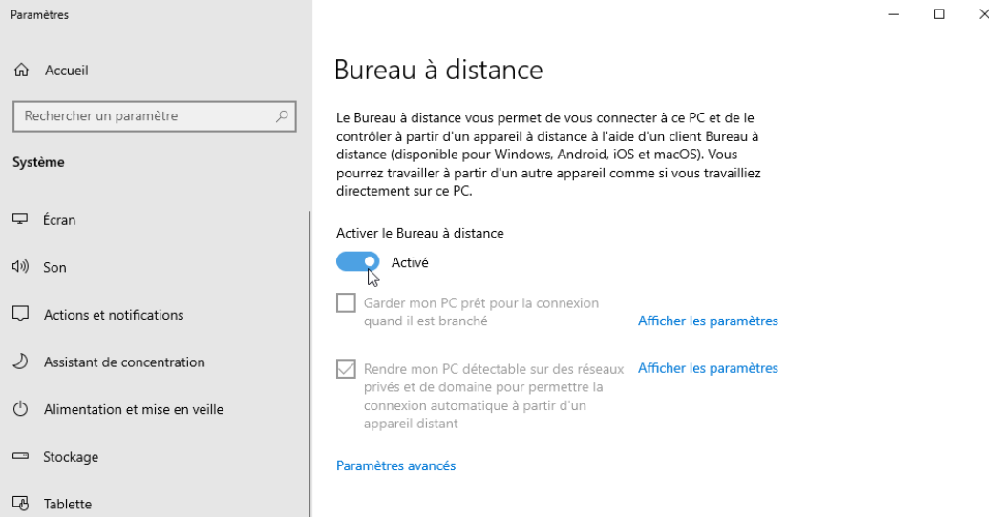
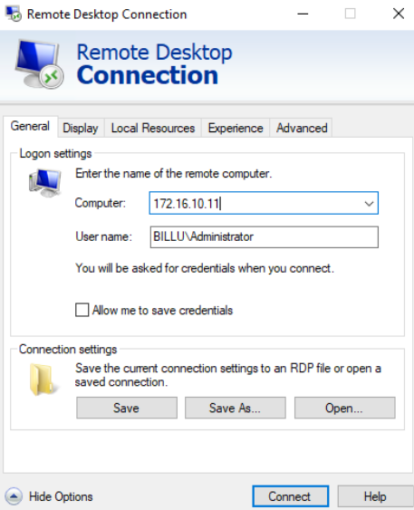
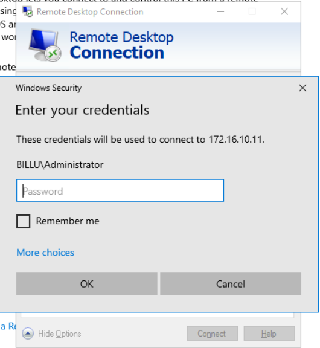
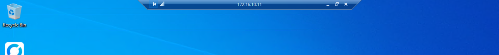

### 1. [Connexion RDS](#RDS)

### 1. Connexion RDS

D'abord, activer le bureau à distance. Pour cela, aller dans **Settings** puis dans **Remote Desktop** et l'activer.

Ouvrir Remote Desktop connection et entrer l'adresse IP de la machine voulue.  
Avec **Show options**, il est possible d'entrer le nom de l'utilisateur sur lequel se connecter. Ici, 172.16.10.11, en se connectant sur le compte Administrator du domaine.  
**Connect** pour s'y connecter.  

Les credentials sont demandés pour s'authentifier.  

Un message signale qu'il n'a pas été possible de vérifier le certificat, car il a été créé par nous même dans l'installation, et qu'il n'a pas été validé par des instances tierces plus crédibles.  
Cocher **Don't ask me again for connections on this computer** et **Yes** pour continuer.  
La connexion est établie et le contrôle grap^hique opérationnel.  
La barre bleue en haut permet de contrôler la fenêtre comme pour de réduire la fenêtre ou bien de stopper la connexion via la croix.  

