# Audit de l'infrastructure BillU

## 🪟 Résultats audit AD

### PurpleKnight

Avant tout type de changement, voici nos résultats initiaux :  
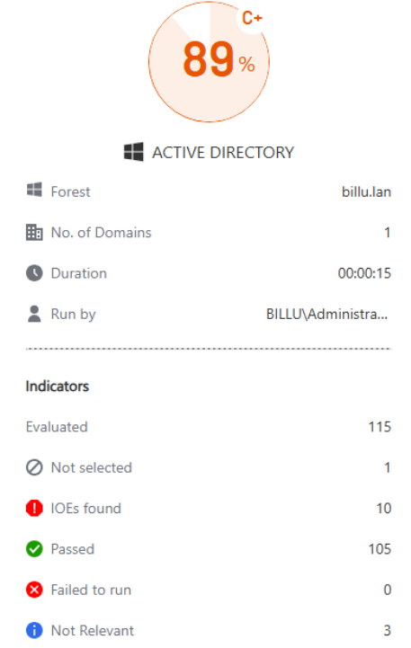  
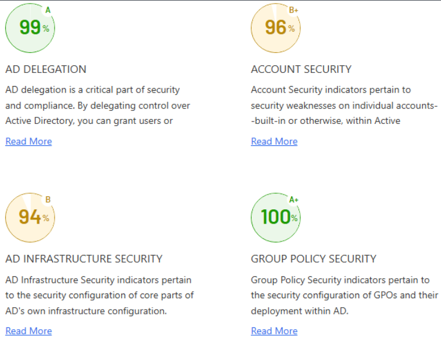  
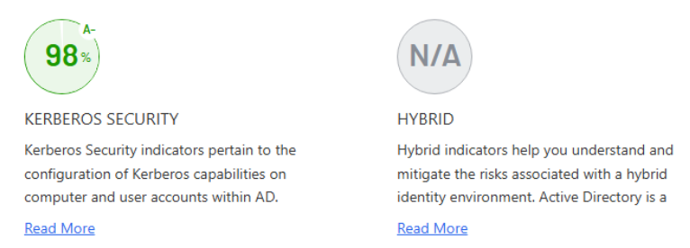  

### Changements
#### Désactiver le cryptage RC4 et DES
Créer une GPO.
Dans l'arborescence
Configuration de l’ordinateur
Paramètres Windows
Paramètres de sécurité
Stratégies locales
Options de sécurité
Network security: Configure encryption types allowed for Kerberos

Cocher uniquement AES-128 et AES-256

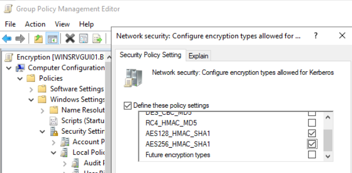

Réactualiser les GPO avec ``gpupdate /force``

#### Désactiver le print spooler

Suivre [ce lien](https://msrc.microsoft.com/update-guide/vulnerability/CVE-2021-34527)

Désactiver l’impression à distance entrante via la stratégie de groupe :

Créer une GPO, et suivre l'arborescence: 
Configuration ordinateur / Modèles d’administration / Imprimantes

Désactiver la stratégie « Autoriser les pouleur d’impression à accepter les connexions des clients » pour bloquer les attaques à distance.

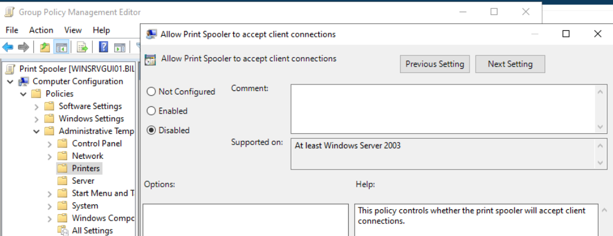

Réactualiser les GPO avec ``gpupdate /force``

#### Changement de mot de passe Administrator
Appuyer sur Ctrl, Alt + Del
Changer de mot de passe.
Entrer un nouveau mot de passe plus complexe. Valider.

#### Suppression de Authentified Users du groupe Pre-Windows 2000 Compatible Access Properties
Dans la console des Users and Computers, click droit sur le nom du domaine, puis **Find**.
Rechercher "Pre-Windows" et cliquer sur **Find Now**
Click droit sur le groupe Pre-Windows 2000 Compatible Access Properties, aller dans **Members** et supprimer Authentified Users.

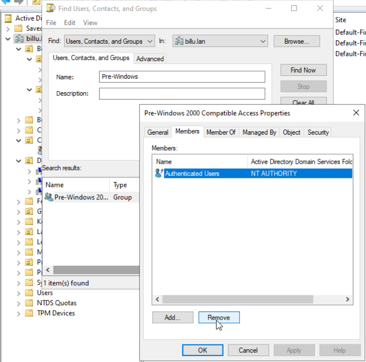  

#### Politique de mot de passe forte pour Administrators
Aller dans la console **Active Directory Domain Controller**, puis dans le domaine, **Security**, **Password Settings Container**.
Dans **Tasks**, cliquez sur **New** puis **Password Settings**

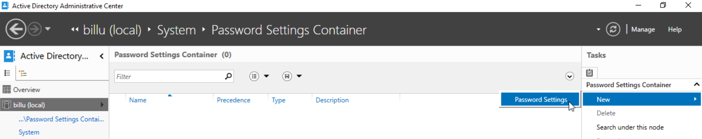

Remplir selon les besoins, par exemple comme ci-dessous :  

Il est possible de vérifier sa bonne application:  
Se rendre dans le domaine, puis **Users**.  
Sélectionner l'utilisateur souhaité, ici, Administrator, et sur la droite **View resultant password settings**.  
La même fenêtre s'ouvre, avec les paramètres édités comme souhaités, montrant bien qu'ils sont appliqués à l'utilisateur sélectionné.

### Policy Analyzer

On voit qu'il y a certains conflits. Il est possible de cliquer dessus pour avoir plus de détail dans la partie inférieure de la fenêtre.  
Par exemple, ici nous avons un conflit entre la GPO Default Domain Policy et la GPO Sec-Ordi-Password-Secure.

 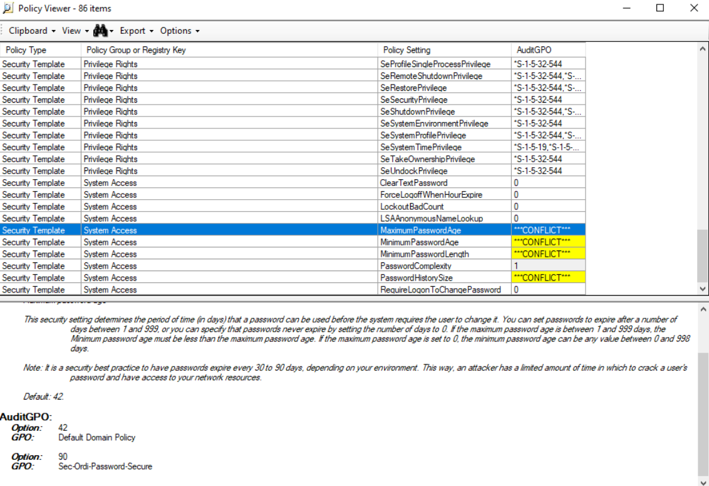

Pour y remédier, retourner sur la console **Group Policy Management**, puis modifier les priorité des GPOs, et faire en sorte que la GPO Default Domain Policy a un nombre de priorité plus élevé (et donc moins prioritaire) que la GPO Sec-Ordi-Password-Secure. Pour cela, sélectionner le domaine (là où sont liées les GPO) et aller dans la rubrique **Linked Group Policy Object** pour modifier le Link Order.  
Si le problème n'est pas résolu il reste possible de désactiver les paramètres de la GPO par défaut en conflit, et ainsi laisser la GPO plus restrictive créée prendre le pas sur ces paramètres.

D'autres conflits concernaient les GPOs WSUS.  
Par exemple, l'heure à laquelle l'installation est programmée, ou encore comment doivent être gérées les mises à jour (auto download et notification pour l'installation, ou bien installation programmée).  
Ces GPOs étant appliquées chacune sur des UO distinctes, elles ne sont pas réellement en conflit. Simplement que différentes paramètres sont appliqués à différentes UO et donc machines.  
En voici un exemple :  
 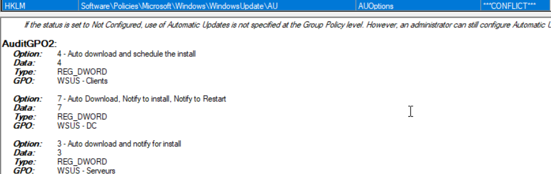

Dans ces cas la, les conflits ont été bien analysés, et une vérification que les GPOs soient bien liées à différentes UO, avec aucun machine en commun sur ces différentes UO.  

### ADACL-Scanner

L'audit a été analysé et les permissions ont été interprétées.  
Cependant, pas d'action n'a été faite pour le moment.  

## 🐧 Résultats audit serveurs Linux pré-fix

### OpenScap

Les résultats d'audit OpenScap sont contenus dans les fichiers `report_LINSRV0X.html` du dossier **Ressources**. Il est possible de les télécharger puis de les ouvrir avec un navigateur afin de consulter l'audit dans son intégralité.

### Lynis

* **LINSRV02 (mail)** : 1 Warning, 53 suggestions

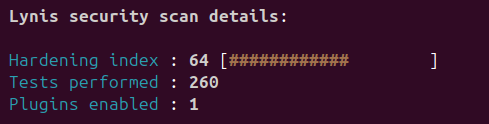

* **LINSRV03 (Zabbix)** : 0 Warning, 44 suggestions

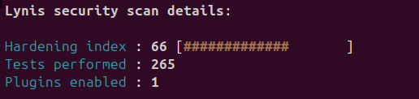

* **LINSRV04 (Bastion)** : 0 Warning, 54 suggestions

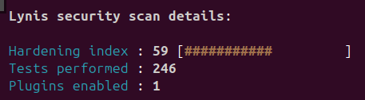

## 🐧 Résultats audit serveurs Linux post-fix

Afin d'améliorer la sécurité de notre infrastructure, nous avons suivi certaines recommandations de nos rapports d'audit. Pour nous assurer que notre infrastructure progresse bien vers plus de sécurité, nous avons ensuite réévalué l'infrastructure avec les mêmes outils.

### OpenScap

Les résultats d'audit OpenScap sont contenus dans les fichiers `report_LINSRV0X_post.html` du dossier **Ressources**. Il est possible de les télécharger puis de les ouvrir avec un navigateur afin de consulter l'audit dans son intégralité.

### Lynis

Le but principal pour Lynis est de nous débarasser sur Warning qui a été trouvé sur le serveur de mail. Certaines autres tâches ont été réalisées et ont pu également réduire le nombre de suggestions.

Il s'agissait pour cela de s'assurer qu'il n'y avait pas d'informations dans le paramètre `smtpd_banner` de la configuration Postfix de notre serveur mail.
