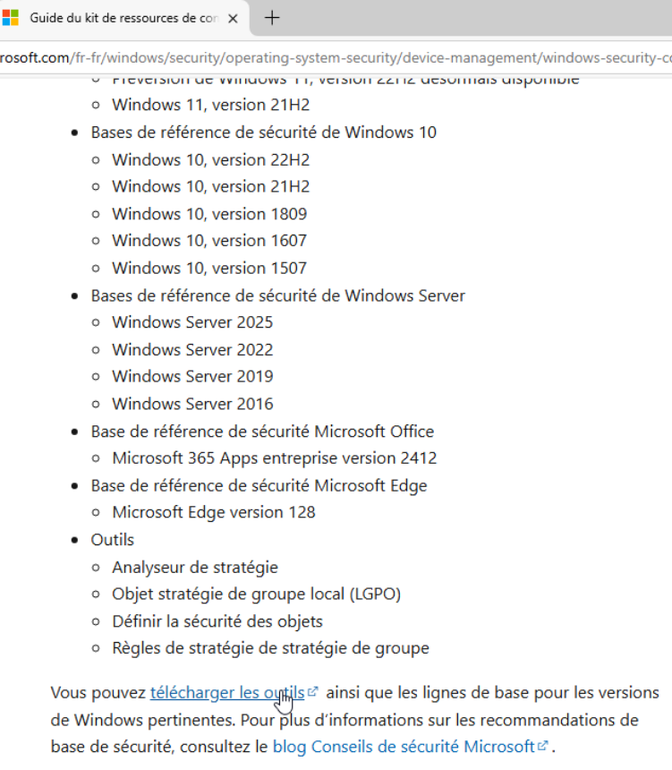

# Guide d'installation Sprint 09

## 🪟 Audit AD

Pour réaliser nos audits sur serveurs Windows, nous utiliserons PurpleKnight, ADACL-Scanner et Policy Analyzer de Microsoft Security Compliance Toolkit.


### PurpleKnight
Sur le [lien du site officiel] (https://www.semperis.com/fr/purple-knight/), cliquer sur **Download Now**  
Entrer une adresse mail, dans ce mail se trouvera le zip à télécharger  
Extraire le dossier

### ADACL-Scanner
Depuis le [github](https://github.com/canix1/ADACLScanner), aller dans la rubrique Download et télécharger le script.

### Policy Analyzer
Policy Analyzer fait partie de la suite d'outils Microsoft Security Compliance Toolkit.  
Se rendre sur [ce lien](https://learn.microsoft.com/fr-fr/windows/security/operating-system-security/device-management/windows-security-configuration-framework/security-compliance-toolkit-10) pour suivre les recommandations de Microsoft.

Télécharger les outils.



Extraire les outils voulus, ici Policy Analyzer.

## 🐧 Audit Linux

Pour réaliser nos audits sur serveurs Linux, nous utiliserons OpenScap et Lynis.

### OpenScap

L'installation de OpenScap se fait à l'aide de la commande suivante :

```apt install openscap-scanner```

### Lynis

L'installation de Lynis se fait à l'aide de la commande suivante :

```apt install lynis```
