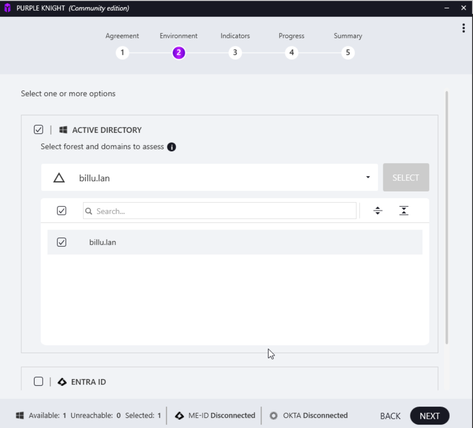
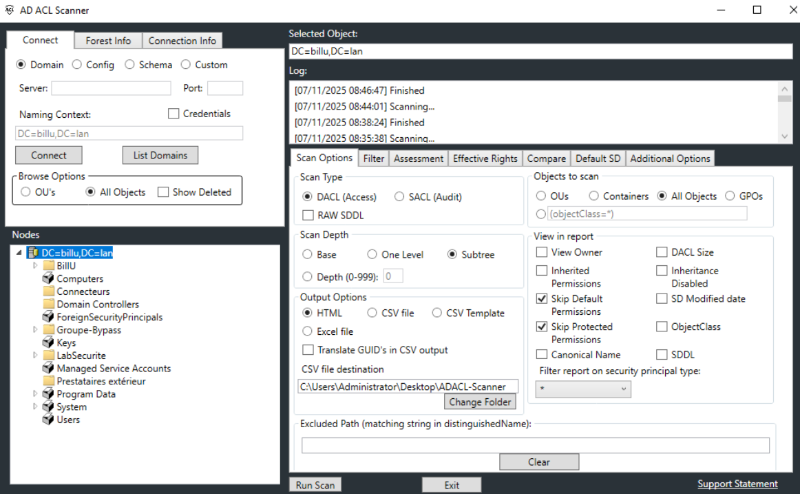
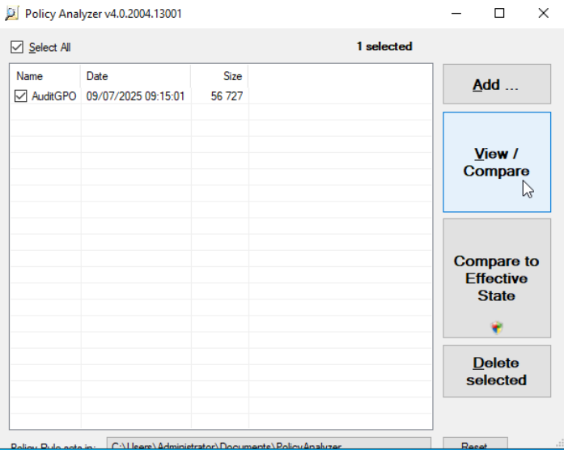

# Guide utilisateur Sprint 09

## 🪟 Audit AD

### PurpleKnight

Exécuter le fichier **PurpleKnight.exe**. Un assistant s'ouvre.

  

Choisir **Active Directory**, puis la forêt et le domaine sur lequel faire l'audit; puis **Next**  
Cocher toutes les cases pour tout inclure dans l'audit. **Run tests**  

### ADACL-Scanner

Lancer le script avec un compte administrateur, une fenêtre s'ouvre pour entrer des informations.

Cliquer sur **Connect**, la structure de l'annuaire Active Directory s'affiche dans la zone "Nodes" en bas à gauche. C'est ici qu'on choisit sur quoi sera fait l'audit. Il est possible de choisir le domaine entier, ou bien des UO spécifiques. Ici, nous allons sélectionner le domaine.  
Dans **Scan Depth**, cocher **Subtree** pour avoir un scan du domaine et de l'ensemble des sous-objets.  
Dans **Objects to scan**, sélectionner **All objects** pour permettre une analyse complète.  
Pour éviter de voir les permissions natives, cocher les options **Skip default permissions** et **Skip protected permissions**.  
Dans l'onglet **Assessment**, il peut être pertinent de cocher **Show color coded criticality** pour afficher les permissions en couleur selon leur criticité.  

**Run scan**

### Policy Analyzer

Pour pouvoir importer les GPOs dans l'outil, il est pratique de sauvegarder les GPOs dans un dossier. Pour cela, dans la console **Group Policy Management**, click droit sur l'OU **Group Policy Objects**, **Back Up All** et choisir un dossier de destination.

Lancer **Policy Analyzer**.
Cliquer sur **Add**, puis **File**, **Add files from GPOs**


 Ajouter le dossier contenant les GPOs. **Import**  
 Choisir un nom de fichier d'audit.  
 
 Sélectionner le fichier créé et cliquer sur **View/Compare**

 

Il est ensuite possible de voir les résultats.

## 🐧 Audit serveurs Linux

### OpenScap

Une fois l'installation effectuée, nous pouvons générer un rapport d'audit à l'aide des commandes suivantes selon la distribution du serveur.

Peu importe l'OS, les résultats seront dans un fichier HTML consultable avec navigateur.

### Debian

```oscap xccdf eval --profile xccdf_org.ssgproject.content_profile_anssi_bp29_minimal --report report.html ssg-debian12-ds.xml```

### Ubuntu

```oscap xccdf eval --profile xccdf_org.ssgproject.content_profile_cis_level1_workstation --results-arf results.xml --report report.html ssg-ubuntu2404-ds.xml```

### Lynis

Peu importe la distribution, l'audit via Lynis est réalisable à l'aide de la commande suivante :

```sudo lynis audit system```
