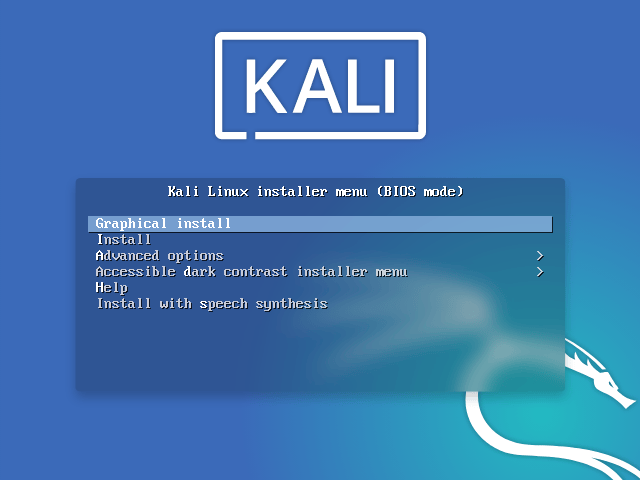

# 🖥️ Guide d'installation Sprint 10

Ce sprint est dédié au pentesting de notre infrastructure. Pour cela nous allons créer deux nouvelles VMs. Une dédiée à l'attaque, et une à la défense. La machine d'attaque tournera sous Kali Linux tandis que la machine de défense tournera sous ParrotOS.

## 🐉 Installation de Kali Linux

Pour installer Kali, nous commençons par uploader l'image _.iso_ obtenue sur le [site officiel de Kali ](https://www.kali.org/get-kali/#kali-platforms) dans les données du serveur Proxmox.

Ensuite, nous créons une VM avec à partir de cette image.

Afin de tester notre réseau, nous ajoutons la carte vmbr100 à cette machine, afin qu'elle soit sur notre réseau LAN.

Au boot de la machine, nous choisissons une installation graphique :

Nous suivons ensuite les instructions pour installer une machine Kali en **Français**, en conservant toutes les options par défaut, y compris le **bureau xfce**.

## 🦜 Installation de ParrotOS

## 🦦 Installation de la machine défense avec Suricata

### Prérequis!
Ubuntu 24.04
2 cores            
4GB RAM

### 1. Installation de Suricata

            sudo apt install suricata  

### 2. Configuration de la carte réseau

- Activer le mode promiscuité

            sudo ip link set dev ens18 promisc on
            sudo ethtool -K ens18 gro off lro off
            ethtool -k ens018 | grep receive-offload -> Vérifier que  tout est off"
            ip a -> vérifier que "PROMISC" apparait bien sur l'interface

### 3. Configuration de suricata

- Editer le fichier de configuration  :

            sudo nano /etc/suricata/suricata.yaml

- Modifier l'adresse de réseau dans "HOME_NET"

            HOME_NET:172.16.10.0/24 "[]

- dans la rubrique "af -packet" :

            af-packet:
            interface: ens18
            cluster-id: 99
            cluster-type: cluster_flow
            defrag: yes
            tpacket-v3: yes

- Mise à jours des signatures (rules)

            sudo suricata-update

- Redémarrer suricata

            sudo systemctl restart suricata

### 4. Vérification et test

- Vérifier la configuration :

            sudo systemctl restart suricata

    La dernière ligne doit ressembler à ça :

            Notice> - all 4 packet processing threads, 4 management threads initialized, engine started.

- Pour tester le fonctionnement au niveau  de l'interface :

            sudo  tcpdump -i ens18

- Tester : Ouvrir 2 fenêtres de terminal 

    - 1er :

            tail -f /var/log/suricata/fast.log

    - 2eme :

            curl http://testmynids.org/uid/index.html 

        Cette commande génère du "bad traffic" qui doit apparaitre dans l'autre terminal

        Pour des informations plus détaillées relancer la commande et consulter ce fichier de log :

            tail -f /var/log/suricata/eve.json | jq .

Installation terminée

 

