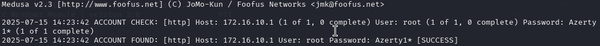
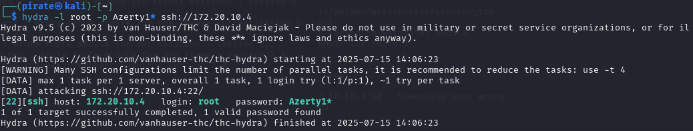

# 🖥️ Guide d'utilisation Sprint 10

Kali Linux et ParrotOS embarquent de nombreux outils utiles pour les pentesters (ou les pirates). Il n'est donc pas nécessaire d'installer de nombreux outils une fois une version de Kali déployée dans notre infrastructure.

Certains de ces outils sont utiles pour attaquer une infrastructure, d'autres pour la défendre.

## ⚔️ Attaque - Kali

Les outils utilisés dans la suite sont installés d'office sur Kali. Dans le cas contraire, le procédé d'installation est détaillé dans [le fichier d'installation](S10_INSTALL.md) de ce sprint.

### 💥 Attaque par force brute

#### 📍 Reconnaissance avec nmap

**nmap** a pour objectif de scanner les ports des hôtes ou réseaux cibles. Il permet de détecter quels ports sont ouverts et donc quels ports il est possible de cibler lors d'une attaque.

Une commande qu'il est possible d'utiliser est la suivante :

```bash
nmap -A 172.16.10.0/24 -v
```

Les paramètres sont les suivants :

* **nmap** : appel de l'utilitaire nmap
* **-A** : détecte également l'OS, la version, les scripts, et le traceroute
* **172.16.10.0/24** : le réseau ciblé, ici notre LAN
* **-v** : verbose, rend la sortie de nmap plus explicite et "verbeuse"

Ce scan global du réseau permet de trouver tous les ordinateurs qui auraient des ports ouverts intéressants pour le pirate, mais également les noms de OS, du domaine...

La totalité des options possibles pour nmap peut être trouvée sur la [documentation officielle](https://nmap.org/man/fr/index.html).

#### 👾 Attaque par force brute avece medusa

**medusa** est un utilitaire permettant de tenter de [bruteforce](https://fr.wikipedia.org/wiki/Attaque_par_force_brute) des identifiants.

Partant du principe que le scan nmap a trouvé un port 22 ouvert sur une machine, on peut lancer une attaque avec la commande suivante :

```bash
medusa -h 172.20.10.4 -u root -p Azerty1* -M ssh
```

Les paramètres sont les suivants :

* **medusa** : appel de l'utilitaire medusa
* **-h 172.20.10.4** : cible l'hôte 172.20.10.4
* **-u root** : cible l'utilisateur root
* **-p Azerty1*** : tente d'entrer le mot de passe Azerty1*
* **-M ssh** : utilise le protocole ssh pour tenter la connexion

Ceci tentera de se connecter en ssh à la machine ciblée, avec le mot de passe **Azerty1***.

Le résultat obtenu avec medusa se présente ainsi :



L'intérêt de Medusa est de fournir, à la place du mot de passe unique _Azerty1*_, un fichier contenant un ensemble de (très) nombreux mots de passe. Medusa effectuera alors des tests à la chaîne (et parallélisés) pour trouver si certains des mots de passe fournis fonctionnent. 

Il faut alors remplacer l'argument **-p** par **-P** et lui passer le chemin vers le fichier contenant les mots de passe. 

Il est également possible de spécifier un argument **-t** suivi d'un nombre, permettant à Medusa de paralléliser (i.e utiliser en même temps plusieurs threads) les processus afin d'obtenir une exécution plus rapide.

Un exemple de commande possible serait alors :

```bash
medusa -h 172.20.10.4 -u root -P motsdepasse.txt -M ssh -t 1
```

#### 🐍 Attaque par force brute avec hydra

Hydra propose des services similaires à ceux de medusa. 

Les noms des paramètres et la syntaxe des commandes changent. Ainsi, la première commande passée précédemment à Meduse serait :

```bash
hydra -l root -p Azerty1* ssh://172.20.10.4
```

Les paramètres sont les suivants :

* **hydra** : appel de l'utilitaire hydra
* **-l root** : cible l'utilisateur root
* **-p Azerty1*** : tente d'entrer le mot de passe Azerty1*
* **ssh://172.20.10.4** : cible l'hôte 172.20.10.4 avec le protocole ssh

Le résultat obtenu avec hydra se présente ainsi :



Similairement à medusa, on peut utiliser un fichier contenant plusieurs mots de passe. La commande devient alors :

```bash
hydra -l root -P motsdepasses.txt ssh://172.20.10.4
```

#### 📜 Script


## 🛡️ Défense - Ubuntu

### 💥 Défense contre la force brute

#### 🔑 Sécurisation de l'authentification

Pour se défendre contre une attaque force brute, il est intéressant de sécuriser les moyens d'authentification.

Pour cela, il est possible d'implémenter une politique de mot de passe stricte, imposant un mot de passe long (12 caractères et plus), combinant majuscules et minuscles ainsi que des numéros et caractères spéciaux.

De plus, un authentification multifacteur est possible (mot de passe plus clé dans le cas du ssh par exemple).

Enfin, il faut s'assurer que les mots de passe sont stockés de manière sécurisées par les utilisateurs.

#### 🔌 Sécurisation des ports

Au delà de l'authentification, il est également possible de sécuriser ses ports.

Des pistes de défense peuvent être la limitation du nombre de tentatives de connexions, ou encore le changement des ports par défaut (particulièrement sensible dans le cas du ssh).

#### 🕵🏼 Surveillance du réseau

Enfin, il est possible de mettre en place des outils de surveillance du réseau (cf. partie Wazuh/Suricata) afin de pouvoir réagir en cas d'activité suspecte.
