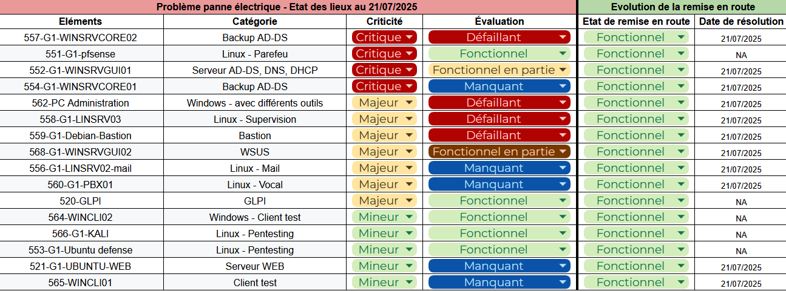

# 🖥️ Guide d'installation Sprint 11

Une panne électrique est survenue ce weekend. Certains équipements ont été endommagés. Il nous incombe donc d'effectuer un diagnostic de nos machines et de réparer/rétablir les services manquants.

Les résultats de notre enquête préliminaire sont les suivants :


## 🪟 Restauration AD & Windows

### Restauration du serveur Windows Server Core 2022 - WINSRVCORE01

La machine WINSRVCORE01 a été totalement détruite par la panne électrique. Il faut donc la recréer. 

Pour cela, nous clonons sur Proxmox le template de machine Windows Server Core. 

Nous changeons son nom et configurons son adresse IP comme indiqué dans notre [documentation](https://github.com/WildCodeSchool/TSSR-2503-P3-G1-BuildYourInfra-BillU/blob/main/S02_03/S02_03_INSTALL.md) précédente.

Puis, nous devons réattribuer les rôles FSMO comme ils étaient distribués préalablement.

Pour cela, nous voulons tout d'abord commencer par récupérer tous les rôles sur le serveur principal (WINSRVGUI01). Pour cela, nous lançons la commande PowerShell suivante depuis ce dernier :

```powershell
Move-ADDirectoryServerOperationMasterRole -Identity "WINSRVGUI01" -OperationMasterRole 0,1,2,3,4 -Force
```

Ensuite, nous pouvons distribuer à nouveau les rôles tel que nous l'avons décrit dans notre [documentation](https://github.com/WildCodeSchool/TSSR-2503-P3-G1-BuildYourInfra-BillU/blob/main/S07/S07_INSTALL.md) précédente.

### Restauration du serveur Windows Server Core 2022 - WINSRVCORE02

Seule la mémoire RAM de cette machine a été atteinte par la panne électrique. Nous l'avons donc remplacée avec 2 Go de RAM.

### Restauration du serveur Windows Server 2022 - WINSRVGUI02

Seule la carte réseau de cette machine a été atteinte par la panne électrique. Nous l'avons donc remplacée.

### Restauration du client Windows Pro - WINCLI01

La machine WINCLI01 a été totalement détruite par la panne électrique. Il faut donc la recréer. 

Pour cela, nous clonons sur Proxmox le template de machine Windows 10 Pro. 

Après avoir vérifié que le DHCP lui a bien attribué une adresse IP, nous l'avons ajoutée au domaine.

### Restauration du PC d'administration - PC-Admin

Seule la mémoire RAM de cette machine a été atteinte par la panne électrique. Nous l'avons donc remplacée avec 2 Go de RAM.

## 🐧 Restauration Serveurs Linux

### Restauration du serveur web - intranet

La machine intranet a été totalement détruite par la panne électrique. Il faut donc la recréer. 

Nous avons repris le guide d'installation de la semaine S5 (INSTALL.md) : [documentation](https://github.com/WildCodeSchool/TSSR-2503-P3-G1-BuildYourInfra-BillU/blob/main/S05/S05_INSTALL.md)

### Restauration du serveur de messagerie - mail
La machine ayant pour rôle le serveur mail a été totalement détruit par la panne électrique. Il faut donc la recréer. Nous avons choisi de créer une conteneur à la place.

Création d'un nouveau conteneur LXC sous debian 12. Ensuite, nous avons repris la documentation pour la création du serveur mail.

Les comptes RoundCube et ThunderBird ont également été recréés via la méthode décrite dans la [documentation](https://github.com/WildCodeSchool/TSSR-2503-P3-G1-BuildYourInfra-BillU/blob/main/S06/S06_INSTALL.md).

### Restauration du serveur de messagerie vocale - PBX01
La machine ayant le serveur FreePBX a été totalement détruit par la panne électrique. Il faut donc la recréer.

Nous avons refait une machine, en suivant la documentation pour l'installation et configuration de FreePBX faite précédemment.

Les comptes FreePBX et 3CX ont également été recréés via la méthode décrite dans la [documentation](https://github.com/WildCodeSchool/TSSR-2503-P3-G1-BuildYourInfra-BillU/blob/main/S06/S06_INSTALL.md).

### Restauration du serveur bastion - LINSRV04

Seule la mémoire RAM et la carte réseau de cette machine ont été atteintes par la panne électrique. Nous les avons donc remplacées.

### Restauration du serveur Zabbix - LINSRV03

La machine LINSRV03 a été totalement détruite par la panne électrique. Il faut donc la recréer. 

Pour cela, nous créons sur Proxmox un conteneur Debian. 

Pour installer et configurer Zabbix, nous reprenons notre [documentation](https://github.com/WildCodeSchool/TSSR-2503-P3-G1-BuildYourInfra-BillU/blob/main/S05/S05_INSTALL.md) préalable, que nous avons mise à jour suite à cette panne.

## ✅ Etat post-restauration

Voici l'état de nos machines après restauration :


