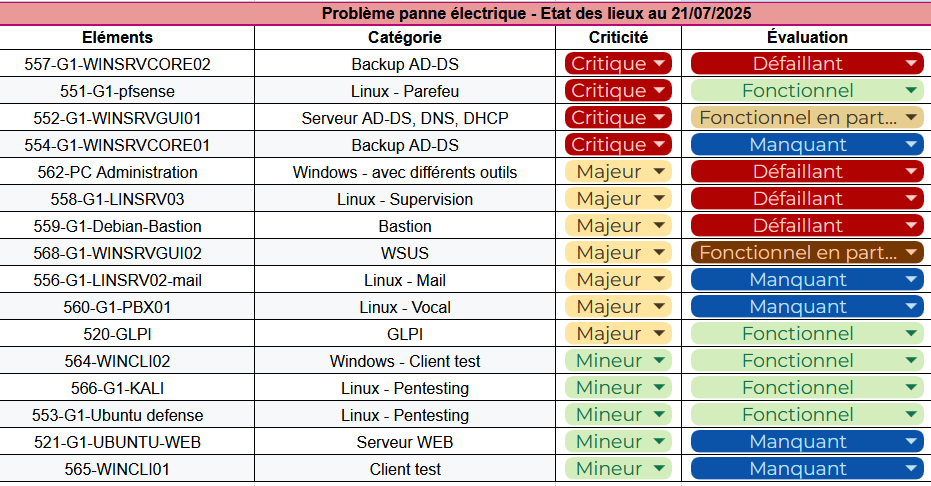

# 🖥️ Guide d'installation Sprint 11

Une panne électrique est survenue ce weekend. Certains équipements ont été endommagés. Il nous incombe donc d'effectuer un diagnostic de nos machines et de réparer/rétablir les services manquants.

Les résultats de notre enquête préliminaire sont les suivants :



## 🪟 Restauration AD & Windows

### Restauration du serveur Windows Server Core 2022 - WINSRVCORE01

La machine WINSRVCORE01 a été totalement détruite par la panne électrique. Il faut donc la recréer. 

Pour cela, nous clonons sur Proxmox le template de machine Windows Server Core. 

Nous changeons son nom et configurons son adresse IP comme indiqué dans notre [documentation](https://github.com/WildCodeSchool/TSSR-2503-P3-G1-BuildYourInfra-BillU/blob/main/S02_03/S02_03_INSTALL.md) précédente.

Puis, nous devons réattribuer les rôles FSMO comme ils étaient distribués préalablement.

Pour cela, nous voulons tout d'abord commencer par récupérer tous les rôles sur le serveur principal (WINSRVGUI01). Pour cela, nous lançons la commande PowerShell suivante depuis ce dernier :

```powershell
Move-ADDirectoryServerOperationMasterRole -Identity "WINSRVGUI01" -OperationMasterRole 0,1,2,3,4 -Force
```

Ensuite, nous pouvons distribuer à nouveau les rôles que nous l'avons décrit dans notre [documentation](https://github.com/WildCodeSchool/TSSR-2503-P3-G1-BuildYourInfra-BillU/blob/main/S07/S07_INSTALL.md) précédente.

### Restauration du serveur Windows Server Core 2022 - WINSRVCORE02

Seule la mémoire RAM de cette machine a été atteinte par la panne électrique. Nous l'avons donc remplacée avec 2 Go de RAM.

### Restauration du serveur Windows Server 2022 - WINSRVGUI02

Seule la carte réseau de cette machine a été atteinte par la panne électrique. Nous l'avons donc remplacée.

### Restauration du client Windows Pro - WINCLI01

La machine WINSRVCORE01 a été totalement détruite par la panne électrique. Il faut donc la recréer. 

Pour cela, nous clonons sur Proxmox le template de machine Windows 10 Pro. 

Après avoir vérifié que le DHCP lui a bien attribué une adresse IP, nous l'avons ajouté au réseau.

### Restauration du PC d'administration - PC-Admin

## 🐧 Restauration Serveurs Linux

### Restauration du serveur web - intranet

### Restauration du serveur de messagerie - mail

### Restauration du serveur de messagerie vocale - PBX01

### Restauration du serveur bastion - LINSRV04

### Restauration du serveur Zabbix - LINSRV03
